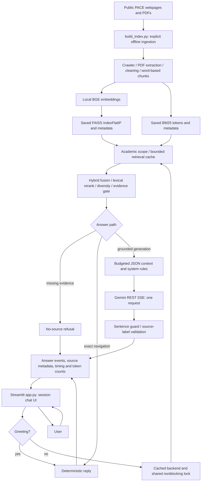

# PACE AI — Architecture, RAG and Optimization Audit

Follow-up: token-aware chunking and safe snapshot selection are now implemented
and activated. See `TOKEN_CHUNKING_REPORT.md` for current results (5,835 chunks,
zero oversized embedding inputs, 89 tests). The original audit below is retained
as historical evidence; its “not rebuilt” statements describe the earlier audit.

Audit date: 12 September 2026. Scope: first-party code, tests, scripts, assets,
configuration examples, dependency manifest and saved corpus/index diagnostics in
`C:\Users\Purna\OneDrive\Desktop\PACE AI\pace-ai-assistant`.
Vendor environments/model weights were not treated as application source.
The credential value was neither printed nor copied into this report.

## Executive Summary

PACE AI is a single-process Streamlit application, not a frontend calling a separate
REST backend. Offline ingestion builds local BGE embeddings, FAISS vectors and a
BM25 corpus. Questions use academic metadata filtering, hybrid retrieval and lexical
reranking before one Gemini streaming request, except for greetings, exact document
navigation and insufficient-evidence refusals. Gemini is selected on this computer;
Qwen remains an optional inactive provider. No generation model was downloaded.

Highest-value findings are correctness/security issues, followed by first-use model
latency. Fixes implemented here cover citation numbering, provenance-preserving
deduplication, redirect validation/resource cleanup, overly broad course shortcuts,
bounded retrieval caching, model/index consistency checks, and Gemini response
validation/usage telemetry. Existing UI and retrieval configuration are preserved.

Important remaining finding: 952 of 3,227 embedding inputs exceed the loaded BGE
model's 512-token window. Changing chunk size requires an evaluated rebuild; this
audit intentionally does not silently replace the live knowledge base.

Validation: baseline 45 tests passed; final 78 passed. One real Gemini request
succeeded. Repeated retrieval/context preparation was below 1 ms for the four
benchmark questions, with identical selected chunk IDs before/after. This does
not imply sub-millisecond answers: Gemini and cold model loading still take time.

## Current Architecture

There are no application REST routes, SQL/NoSQL database, uploaded-file endpoint,
authentication/authorization layer, saved chat database, or cross-user chat memory.
Streamlit supplies its own HTTP/WebSocket server. `ask.py` is an alternate CLI
entry point. `st.session_state.messages` is display history only: it is not sent
to Gemini, so follow-ups such as “what about semester two?” lack previous context.

Local storage is under `data/raw`, `data/cleaned`, `data/index`, `data/cache`.
The existing snapshot reports 120 webpages, 46 PDFs, 3,530 nonempty PDF page
records, 3,151 cleaned documents, and 3,227 chunks. Its refresh timestamp is
2026-09-08; these are saved corpus counts, not a fresh crawl. The index contains
193 webpage chunks and 3,034 PDF chunks. FAISS dimensions measured directly: 384.

## Current RAG Pipeline

| Stage | Actual implementation | Input → output | Bottleneck, bug or opportunity |
|---|---|---|---|
| Submit/render | `app.py`, `ask_suggestion`, main submit block | Typed/suggested text → one question; token/replace/complete events → session message | Reruns whole history; rendering throttled to 10 updates/sec; pending suggestions consumed once |
| Load backend | `src/ui.py:backend`, `src/runtime.py:load_pipeline` | Saved index files → cached pipeline and shared lock | Lazy first model inference is slow; lock covers retrieval and entire generation; restart required after rebuild |
| Validate/route | `RagPipeline.stream`, `answer_policy.conversational_reply` | 1–1500 characters → greeting or retrieval | Backend validation added; greetings avoid model/backend initialization in UI |
| Academic scope | `academic_query.parse_academic_query`, `matches_document`; `HybridRetriever._academic_scope` | Question and title/URL identity → allowed source URLs | Explicit branch/regulation filtering before top-K avoids R21/R23 contamination; ambiguous branches and lowercase “it” need evaluation |
| Retrieval cache | `HybridRetriever.search` | Exact stripped question + effective top-K → stored results or miss | New bounded TTL/LRU cache; no generated-answer cache; case retained for IT semantics |
| Exact syllabus shortcut | `HybridRetriever._search`, `_intent_candidates`, `course_structure_excerpt` | One branch/regulation/PDF with parseable course rows → overview candidates | Skips embedding only for unambiguous parsed overview; wrapped table rows skipped |
| Query embedding | `EmbeddingModel.encode_query/model` | BGE instruction prefix + question → normalized float32 vector | First call imports Torch/Sentence Transformers and loads cached weights; no embedding API |
| Vector search | `VectorStore.search` | Vector + optional allowed URLs → 8 candidates | Exact normalized inner product/cosine; scoped search ranks all vectors then filters before top-K |
| Keyword search | `BM25Search.search` | Tokenized question → up to 8 keyword candidates | Full corpus scores and argsort; title/URL boosts; runs sequentially after vector search |
| Fusion/rerank | `HybridRetriever._search`, `ResultReranker.rerank` | Merged IDs, normalized scores, intent candidates → up to 4 results | 50/50 vector/BM25 fusion, 85/15 fused/lexical rerank; repeated metadata/text processing; intent overrides may be over-broad |
| Diversity/gate | `_search`, `has_sufficient_evidence`, `RagPipeline._prepare` | Ranked chunks → eligible evidence | Max 2 chunks/source; final ≥ .35 and vector ≥ .58 OR lexical ≥ .25 OR intent ≥ .8; scores are heuristics, not probabilities |
| Context | `RagPipeline._prepare` | Up to 3 eligible chunks, 900-word budget → question + JSON source objects | Greedy budget can starve later chunks; formerly duplicate-page labels disagreed with deduplicated source cards; fixed |
| Prompt | `src/llm.py:SYSTEM_PROMPT` | Context-only rules + current question → provider payload | Duplicate contract removed from user prompt; context explicitly untrusted; escaping reduces delimiter ambiguity, not semantic injection |
| Generate | `GeminiLLM.stream_with_usage` | Current question/public excerpts → SSE answer text + usage counts | One POST, output cap 1024; 10s connect/45s read timeout; no automatic retries; provider latency/quota external |
| Quality/source response | `guarded_text`, `RagPipeline.stream/_sources/format_sources` | Generated sentences → answer/replacement, source list and timing | Repetition guard, refusal cleanup, final citation range check; not claim-to-source entailment verification |
| UI final response | `app.py`, `src/ui.py:answer_body/render_details/source_cards` | Structured sources/timings → linked cards and optional diagnostics | Safe escaped official links; history keeps full retrieved text even when diagnostics hidden |

One generated placement question traverses the full path above. A greeting skips
retrieval and Gemini; an AIML R23 overview can use parsed source tables; explicit
missing R99 scope returns no-source refusal. Failed generation is not retried
automatically by the UI. One manual retry by the user is a new request.

### Ingestion, cleaning and chunking

`build_index.build` orchestrates `PaceCrawler.crawl`, `PacePdfLoader.load_many`,
`TextCleaner.clean`, `DocumentChunker.chunk`, `VectorStore.build`, and
`BM25Search.build`. Defaults: 120 pages, depth 3, 80 PDF links, 0.75s request delay,
20s network timeout, 40 MB/PDF. GET retries use exponential backoff. Crawling strips
query strings/fragments, prioritizes academic links, excludes external links and
checks robots.txt. Robots fetch failure currently allows crawling; robots crawl
delay is not interpreted. Crawl queue/skipped URL count and HTML bytes are not
independently bounded. New redirect checks cover both initial and redirected URLs.

PDF extraction uses PyMuPDF sorted plain text per nonempty page, preserving source
URL and one-based page number. No OCR or layout/table reconstruction exists.
An image-only PDF now has `no_text` manifest status; partial blank pages are still
not separately counted. PDF caching is URL-derived and indefinite, with no ETag or
Last-Modified revalidation. A changing PDF at the same URL can therefore stay stale.

Cleaner removes recognized noise, consecutive duplicate lines and short lines
repeated in ≥25% of the entire corpus (minimum 3 records). This global rule is not
per-PDF header/footer detection: it can miss headers of one long PDF or remove
legitimate shared text. Previous text-only global dedup discarded other documents'
provenance. Cleaner/chunker now deduplicate by URL, page and text digest, preserving
distinct source identities. This increases corpus size on next rebuild; it does
not restore records already absent from the live index.

Chunking is `RecursiveCharacterTextSplitter` with a **word-count** length function,
600 words, 100-word overlap, paragraph/newline/sentence/semicolon/comma/space
separators. It is not token-based or semantic chunking. Page boundaries and chunk
metadata are retained; `section` is generally the first heading, not a guaranteed
nearest heading. Existing sizes: min 5, median 248, p95 410, max 600 words.

Measured model window is 512 tokens including metadata/special tokens. 952 inputs
exceed it. Proposed experiment: tokenizer-budgeted ~384–448 total input tokens,
~48–64 overlap tokens, preserving course rows and page provenance, with metadata
inside the budget. Smaller chunks improve precision and prevent embedding tail
truncation but require more vectors, may omit course context and may need adjacent
chunk expansion. Larger chunks retain context but increase prompt size and mix
topics. Compare recall@K, regulation accuracy, answer support, latency and token
counts on labeled PACE questions before selecting parameters. No blind setting
change, automatic embedding rebuild, multi-query expansion or cross-encoder was
introduced.

### Embeddings and persistence

BGE-small-en-v1.5 runs locally, 384 dimensions, normalized float32 vectors, batch 32
for ingestion. FAISS uses exact `IndexFlatIP`, appropriate for 3,227 vectors. There
is no paid embedding API. Model objects and downloaded weights are already cached;
index files persist across restarts. Query embeddings previously repeated every
question; retrieval-cache hits now avoid them as well as BM25/reranking.

`build_index` reuses all vectors when its fingerprint matches, otherwise embeds
all chunks; BM25 rebuilds even with unchanged content. Fingerprint is not a complete
versioned digest of serialized embedding inputs: document type/provenance/case
changes can be missed. Introduce exact content/config/schema fingerprints and
per-input embedding reuse in a future staged rebuild. Keep metadata records separate
from reusable text vectors so provenance is preserved without redundant inference.

FAISS data, vector metadata and BM25 are separate atomic file replacements, not one
atomic snapshot. New startup checks reject embedding-model mismatch and unequal
FAISS/BM25 metadata; equal-size vector/content mismatches still require checksummed
versioned manifests. Stop serving during rebuild for now; caches hold a loaded
snapshot until restart. BM25 now shares the validated vector metadata list at
runtime, releasing the redundant record list. Peak JSON-loading allocation and
duplicated metadata on disk remain. Files measured: FAISS 4,956,717 bytes, vector
records 6,797,365 bytes, BM25 corpus 21,096,526 bytes. Process RSS savings were not
measured, so none are claimed.

## Problems Identified

| Priority | Problem | Location | Impact/status |
|---|---|---|---|
| High | Same-page chunks numbered separately, cards deduplicated | `RagPipeline._prepare/_sources/_direct_answer` | Incorrect source references; fixed with shared URL/page identity |
| High | Text-only dedup drops other PDF/page provenance | `TextCleaner.clean`, `DocumentChunker.chunk` | Regulation/document coverage lost; fixed for future ingestion, live snapshot unchanged |
| High | Redirects bypass PACE URL boundary | Crawler/PDF GET calls | External/private destinations reachable from official redirects; fixed application-level host/port checks |
| High | Embedding input exceeds 512-token window | Chunker/`VectorStore._searchable_text` | 952 truncated inputs; evaluated token-aware rebuild needed |
| High | Broad course shortcut ignores qualifiers, asserts hardcoded degrees | Retriever intent / direct answer | Unsupported facts/wrong fee/branch answers; shortcut narrowed and fabricated list removed |
| High | Key was previously shared in a chat image | Operational credential management | User-led rotation recommended; no key displayed in this audit |
| High before public access | No login/rate limit, shared process lock | `app.py`, deployment | Public exposure would allow quota abuse and busy responses; remains localhost-only |
| Medium | Cold semantic retrieval dominates first answer | `EmbeddingModel.model` | 11–27s measured first retrieval across runs; warmup option needs separate measurement |
| Medium | Repeated retrieval recomputation | `HybridRetriever.search` | Fixed bounded TTL/LRU; no reduction in Gemini calls for generated answers |
| Medium | Multiple independently replaced index files, no reload | Build/runtime/UI resource caches | Mismatch and stale index risk; validation added, transactional publication deferred |
| Medium | Stale PDFs and manual stale crawl snapshots | PDF cache/build reuse flags | Content can lag official sources; conditional refresh needed |
| Medium | Department/service/question-paper intent too coarse | `_intent_candidates`, `_prepare` | Can exclude genuinely relevant detailed evidence; expand qualifier/negative tests before changes |
| Medium | Prompt-only grounding and superficial citation labels | System prompt/answer policy | Prompt injection and factual hallucination remain possible; range check is not entailment |
| Medium | No usage telemetry / malformed stream handling gaps | `GeminiLLM` | Added count/finish telemetry, bounded SSE event size, safe shape errors and premature EOF rejection |
| Medium | Global headers heuristic and no OCR/table recovery | Cleaner/PDF loader | Missing or damaged course rows; targeted extraction QA/OCR needed |
| Medium | Unbounded per-session full-text history | `app.py` | Memory and rerender growth, no actual follow-up memory; bound/paginate with clear UX |
| Medium | No request-wide deadline; no cancellation control | Gemini/Streamlit | Slow trickle can outlast read timeout; keep user-friendly failure, evaluate deadline/cancel semantics |
| Low | Stale/inconsistent documentation, duplicated optional dependencies | README/requirements | Updated operational guidance; split optional generation dependencies later |
| Low | Badge says online based only on key presence | `app.py` | Not an API health check; rename to “configured” instead of adding paid health calls |

## Recommended Improvements

| Change | Current behavior → implemented/proposed change | Benefit and trade-off | Files; impact / effort / risk |
|---|---|---|---|
| Provenance/citations | Text-only dedup and chunk labels → URL/page-aware dedup and shared labels | Correct links and retained coverage; more indexed records after rebuild | cleaner, chunker, rag_pipeline; High / Low / Low code, Medium rebuild |
| Download safety | Automatic redirects, leaked response handles, full PDF read for header → validate each hop, finally-close, read 4 bytes | Prevents off-host requests and avoidable memory use; legitimate external CDN documents intentionally rejected | public_http, crawler, pdf_loader; High / Low / Low |
| Narrow navigation | Generic course term check + degree list → explicit overview whitelist + official page navigation | Removes unsupported assertions; qualified questions may use Gemini and cost more | academic_query, retriever, rag_pipeline; High / Low / Low |
| Retrieval caching | Same inference/ranking repeated → exact-key bounded TTL/LRU per snapshot | Measured repeat speedup, no added service; uses some memory and requires snapshot lifecycle discipline | config, retriever; Medium / Low / Low |
| Prompt/transport checks | Duplicate rules/plain delimiters, unchecked source labels/response shapes → system-only contract, JSON context, label guard, safe SSE parsing and usage | Clearer trust boundaries and actionable diagnostics; possible fallback for otherwise helpful uncited text, JSON may increase tokens | rag_pipeline, llm; High correctness / Medium / Medium |
| Snapshot consistency | Only vector count check → model identity and full metadata agreement, shared metadata objects | Fail closed on detectable mismatches, avoids duplicate retained records; no transactional rebuild guarantee | runtime; High / Low / Low |
| Token-aware chunk experiment | Word-based oversize embedding inputs → measured tokenizer budgets and course-row-aware splits | Better represented content expected; requires new index, gold questions and accuracy/latency evaluation | chunker, vector_store, tests; High / Medium / Medium |
| Conditional incremental indexing | Indefinite URL cache + all-or-nothing vectors → conditional GET + versioned fingerprints/per-text vectors | Fresher sources and less repeated processing; more cache metadata and invalidation complexity | pdf_loader, crawler, build_index; High / Medium / Medium |
| First-question warmup | Model loaded on student request → optional startup/background warmup with readiness state | Moves setup delay outside first question, does not reduce work; RAM/startup CPU consumed even when idle | runtime, embeddings, launcher/UI; High UX / Medium / Medium |
| Bounded history | All messages/excerpts retained and rerendered → capped/paginated session history and compact diagnostics | Predictable memory/render time; user needs visible retention/export choice | app, ui; Medium / Low / Low |
| Safe multi-user operation | Single global lock rejects concurrent answers → bounded generation queue/semaphore and independent local inference lock | Better concurrency where needed; must honor actual quota and memory, requires load tests | app, ui, runtime; High at scale / Medium / Medium |
| Evaluation/observability | Heuristic tests and manual print reports → labeled query fixtures, claim/citation review, stage p50/p95, TTFT and usage logs without question text | Makes parameter changes evidence-based; needs curated source-grounded answers and maintenance | tests, rag_pipeline, llm; High / Medium / Low |

### Cache policy

New cache stores retrieval results only; key is the stripped exact question and
effective top-K. Size 128, TTL 300 seconds; zero size/TTL disables. Whitespace only
at the ends is normalized; case/punctuation preserved. Entries are isolated from
caller mutation by copying their dictionary structure. Expired entries are removed
on search; least-recently-used entries are evicted at capacity. It is RAM-only and
shared by the process, not written to disk. It contains questions and public source
matches, not keys or Gemini responses. It is suitable for the current public corpus,
not future tenant-specific/private documents without scope in the cache key.

All retrieval configuration belongs to the immutable pipeline instance. Restart
after corpus/model/config updates; do not mutate a loaded store in place. TTL
does not refresh the underlying FAISS/BM25 snapshot. Existing PDF/model/resource
caches have different lifetimes. Automatic Gemini answer caching is deferred to
avoid stale policy/admission answers and cross-user private-question reuse.

### Gemini usage, prompt and cost

Selected model is `gemini-3.5-flash`; provider is `gemini`. Requests use Google's
v1beta `streamGenerateContent` endpoint, `x-goog-api-key` header, server-side system
instruction, one user turn, `maxOutputTokens=1024`, and `thinkingLevel=MINIMAL` for
that exact model. Temperature is not set (provider default); local llama.cpp uses
0.0. No tools, query rewrite, multi-query LLM, second verification LLM or chat
history are sent. Greetings/exact overviews/refusals make zero Gemini calls;
otherwise normally one. No retries are added after partial text, preventing hidden
duplicate generation charges. Future retry should be bounded, only transient
pre-output failures, with backoff/Retry-After and user visibility.

Usage telemetry records counts actually returned by Gemini, not guessed pricing.
The live placement call returned 1,920 prompt tokens, 92 candidate tokens, 2,012
total tokens, finish reason STOP. Thought text is filtered; missing counts are
unknown, not zero. No dollar savings or quota limits are claimed. Field meanings
and request schema follow the [Gemini API reference](https://ai.google.dev/api/generate-content).

The duplicate response contract was removed from the user prompt; JSON source
objects make metadata/excerpts unambiguous and preserve full-chunk newlines. In
the placement benchmark prompt characters rose from 6,192 to 6,254 despite removing
rules because JSON/newline escaping adds overhead. Other measured prompts shrank.
Whitespace word counts of escaped JSON are not model tokens and are not comparable
cost estimates. Therefore no prompt-token reduction claim is made. Use actual
usage counts to evaluate future budgeted sentence/row extraction. Current 900-word
context budget is not a tokenizer limit. At most three chunks, not necessarily
three unique sources, enter the context.

Requests' read timeout is an inactivity timeout, not a request-wide deadline.
A periodically arriving stream may last longer. See the [Requests timeout
documentation](https://requests.readthedocs.io/en/latest/user/quickstart/#timeouts).
An absolute deadline/cancel mechanism remains follow-up work.

## Security and Reliability

- `.env` is ignored; config key field has `repr=False`; credential stays in the
  Google request header, never prompt, source card, URL or debug timing. UI logs
  exception class only, not raw provider bodies. A limited known-key-pattern scan
  found no matches in first-party Python/JS/Markdown/TOML. This is not a complete
  secret scan. Git status/history could not be inspected: Git fails trying to
  access the enclosing `C:/Users/Purna` repository. Committed secrets are **not
  verified absent**. Rotate the previously shared key manually and review history
  before publishing; no credentials were changed by this audit.
- No uploads exist, so upload validation/auth/CORS claims are not applicable.
  The downloader now checks initial URLs before cache access and every redirect,
  limits redirects to 3, blocks HTTPS downgrade, credentials/nonstandard ports and
  off-host destinations, and enforces declared/actual PDF byte limits. Cached file
  freshness, malicious-PDF parser isolation, DNS/network egress defense, HTML byte
  limits and whole-crawl time bounds remain. A hostname allowlist is not a complete
  network-level SSRF defense.
- Official documents remain untrusted input. A compromised PDF/page can say
  “ignore the rules,” fabricate citations, ask for disclosure of the question or
  emit a tracking-image URL. There is no upload UI, but the same risk would apply
  to future uploaded PDFs. Separate system rules, escaped context records, no
  privileged tools and known-label checks reduce risk, not eliminate it. Add
  adversarial question/document fixtures and claim/source evaluation. Consider a
  restricted Markdown renderer blocking remote images/nonofficial links; current
  assistant Markdown uses default HTML safety but is not an outbound-link policy.
- Source cards escape text/attributes and permit official HTTP(S) URLs/standard
  ports. Only checked-in CSS/JS is rendered with trusted HTML/JS. Do not ever feed
  model/source text into `st.html(... unsafe_allow_javascript=True)`.
- Localhost binding remains; no authentication was added because public deployment
  is not requested. Do not expose it publicly without authentication, request
  limits, TLS/reverse-proxy review, quota controls and history retention policy.

| Failure | Actual behavior after changes | Remaining limitation |
|---|---|---|
| Invalid/oversize PDF or fetch error | Response closed; partial removed; manifest error; other PDFs continue | Real hostile-file sandbox/resource limits not implemented |
| PDF has no extractable text | `no_text` manifest status, no chunks | No OCR; no useful-text/blank-page dashboard |
| Embedding failure | Local model/load/inference exception; safe UI generic error; CLI fails | There is no embedding API; corrupt local cache recovery is manual |
| Missing/corrupt/mismatched index | Missing/count/model/metadata errors; UI safe failure | UI setup message can be more specific; checksums/transactional snapshots needed |
| No relevant evidence | Fixed refusal, no supporting cards, zero Gemini requests | Threshold calibration needs labeled false-positive/negative set |
| Gemini 400/401/403/404/429/5xx | Safe status-specific or availability message; no raw body/key | No automatic retry; quota numbers not assumed |
| Network timeout/disconnect | Safe connection message; UI clears partial answer | Read inactivity timeout only |
| Malformed SSE/event shape / oversized event / premature EOF | Safe service error and closed response | Total stream wall time not bounded by event-size check |
| Repetition/unknown/missing citation labels | Transparent replacement with no supporting cards | Previously streamed valid-looking sentences can be briefly visible; not entailment checking |
| MAX_TOKENS | Finish reason visible; sentence guard drops incomplete tail | Complete preceding sentences can still be partial coverage |

## Performance Measurements / Before vs After

Method: same production index and config, offline cached BGE model, one fresh
process per benchmark; four questions, four runs each. Table uses median of the
three repeated runs after each first run. Measured stage is `_prepare` (retrieval
plus context construction), not Gemini, UI/network round trip or concurrency.

| Repeated question | Before median | After median | Source IDs |
|---|---:|---:|---|
| Placement services | 145.375 ms | 0.390 ms | Identical |
| Courses offered | 205.068 ms | 0.124 ms | Identical |
| AIML R23 overview | 316.809 ms | 0.156 ms | Identical |
| Missing AIML R99 | 11.867 ms | 0.018 ms | Empty in both |

First semantic retrieval was 27.224s before and 11.615s after in these two runs;
OS file cache, concurrent machine activity and imports differ. The implementation
does not remove cold model loading, so **do not attribute that difference to the
new retrieval cache**. Index construction/load was 0.571s vs 0.519s; no statistically
meaningful startup claim is made from one sample per revision.

Separate post-change live acceptance: greeting 0.0001s; AIML R23 overview 0.1277s;
missing R99 0.0054s; placement retrieval 12.2556s, Gemini 2.5771s, pipeline total
14.8334s. This includes one cold semantic lookup but excludes UI/backend import
startup. There is no paired before/after Gemini benchmark, so no generation-speed
or monetary savings claim. Provider latency naturally varies.

Offline processing dry run of cached raw data took 4.182s, yielded 3,630 cleaned
records and 3,721 chunks under source-preserving dedup. This is **not** an indexed
production rebuild, new PDF extraction timing or evidence of higher answer accuracy.
Existing 8.922s historical rebuild timing in status.json is not a comparable
before measurement. No download, embedding-rebuild, process-RSS or 100-user
benchmark was performed. Expected benefits for those require benchmarking.

BEFORE: repeated queries recomputed retrieval; context/card labels could disagree;
redirects followed automatically; some course answers asserted an ungrounded degree
list; no Gemini token telemetry; global text dedup could discard provenance.

AFTER: same Streamlit → local hybrid retrieval → Gemini architecture; bounded
retrieval reuse, shared citation identity, scoped downloads, narrower grounded
navigation, request-local usage telemetry and source-aware ingestion. No framework,
model/provider replacement, new service, new key, corpus rewrite or UI redesign.

## Scalability

| Concurrent demand | Code-backed assessment | Sensible next architecture step |
|---|---|---|
| 1 user | Supported workflow verified; cold load noticeable | Keep current process and exact FAISS; optional warmup |
| 10 users | Shared nonblocking lock permits one non-greeting answer; others see busy | Bounded queue/concurrency with separate inference lock, then measure quota and latency |
| 100 users | Not load-tested; full per-session text/history and sync provider work grow memory | Add authentication/rate limits, bounded histories, queue metrics; assess whether a thin API/worker split is justified |
| 1,000+ users | No capacity claim possible | Capacity tests, replicas/versioned shared artifacts, admission control and measured retrieval service scaling; do not add microservices speculatively |

FAISS itself is not the current observed bottleneck. Parallelizing BM25 with vector
inference could save only a few measured milliseconds while complicating thread
contention. Start with cold readiness, retrieval quality and request concurrency.
No DB queries/connections exist to optimize. Multi-query retrieval adds Gemini
calls and latency and is not warranted without recall evidence. Cross-encoder is
already optional; compare it offline, not enable by default.

## Optimization Priority

### Priority 1 — High Impact

Implemented low-effort correctness/security fixes: source identity, download
boundary/cleanup, course shortcut, runtime consistency. Next: rotate the exposed
credential; build labeled retrieval/citation tests and evaluate token-aware chunks;
publish rebuilt indexes as complete versioned snapshots, not independent live writes.

### Priority 2 — Medium Impact

Bounded retrieval caching and Gemini telemetry implemented. Next: explicit optional
embedding warmup, PDF conditional refresh, per-input embedding cache, qualifiers
for other intent shortcuts, bounded session history and measured concurrency.

### Priority 3 — Nice to Have

Precomputed intent/lexical features, partial top-K selection instead of full sorts,
optional cross-encoder, OCR for measured scanned-document gaps, multilingual
evaluation, and separate cloud-only/local dependency groups. None justifies replacing
FAISS, Gemini or Streamlit at this corpus size without additional evidence.

## Code Changes

| Modified/added file | Change |
|---|---|
| `config.py`, `.env.example` | Retrieval cache size/TTL controls; real `.env` unchanged |
| `src/public_http.py` (new) | PACE URL/port/redirect validation and bounded manual redirect following |
| `src/crawler.py` | Guarded GET/robots redirects, final URL for relative links, response closure |
| `src/pdf_loader.py` | Guarded downloads/cache-entry URL validation, closed responses, 4-byte signature read, no-text manifest, file-error isolation |
| `src/cleaner.py`, `src/chunker.py` | Dedup identity includes URL and page |
| `src/academic_query.py` | Explicit course-overview predicate |
| `src/retriever.py` | Predicate shared with generation, validated question/top-K, bounded TTL/LRU retrieval cache with hit timings |
| `src/rag_pipeline.py` | Stable page labels, JSON context, remove duplicate prompt rules/unsupported list, close guarded streams, question validation, citation checks and usage timing |
| `src/llm.py` | Optional usage-stream interface, request-local token counts, safe unexpected SSE shapes, event bound and premature EOF check |
| `src/runtime.py` | Model/metadata consistency checks and shared metadata list |
| `src/ui.py` | Source links reject nonstandard ports |
| `tests/test_crawler.py` | HTTP fixture supports explicit redirect and close behavior |
| `tests/test_rag.py` | Course navigation asserts no unsupported degree claim |
| `tests/test_gemini.py` | Unexpected response-shape, token telemetry and premature EOF regressions |
| `tests/test_audit_fixes.py` (new) | Download/redirect/size, provenance, query qualifier, cache, citation, validation and index consistency regressions |
| `tests/manual_audit_check.py` (new) | Repeatable offline production-index timing/source/prompt benchmark |
| `tests/manual_corpus_audit.py` (new) | Token-window/corpus and isolated ingestion dry-run diagnostics |
| `README.md`, `PROJECT_NOTES.md` | Current behavior, cache lifecycle, measured evidence, safe startup/config guidance |
| `OPTIMIZATION_REPORT.md` (new) | This audit and remaining work |

Generated reports, not source/index replacement: `data/index/audit_before.json`,
`audit_after.json`, `audit_corpus.json`; existing `gemini_acceptance.json` and
`retrieval_acceptance.json` were refreshed by their manual test scripts. Saved
FAISS/BM25, raw PDFs, credentials, dependencies, crest, CSS and application layout
were not modified.

## Validation

Commands run using bundled Python 3.11 with `.venv/Lib/site-packages` and project
directory on PYTHONPATH:

| Check | Result |
|---|---|
| Baseline `python -m pytest -q` | 45 passed in 27.11s |
| Final `python -m pytest -q --tb=short` | 78 passed in 17.98s, including Streamlit AppTest and offline PDF/FAISS/BM25 integration |
| `python -m compileall -q app.py ask.py build_index.py config.py src tests` | Passed |
| `python -m pip check` | No broken requirements found; not a vulnerability scan |
| `python -m tests.manual_audit_check --output data/index/audit_before.json` and after equivalent | Four questions × four runs each, same chunk IDs; timings above |
| `python -m tests.manual_corpus_audit` | Cached production corpus/token diagnostics and temporary-output clean/chunk processing succeeded |
| `python -m tests.manual_fix_check` | Greeting, AIML R23/R99 and one real Gemini placement answer passed; no key printed |
| `python -m tests.manual_retrieval_check` | 11-query diagnostic completed; unrelated FIFA query had zero eligible chunks; this script reports candidates, not scored gold-label accuracy |
| `start.ps1` + HTTP health check | New server running on 127.0.0.1:8502; `/_stcore/health` returned 200 `ok` |
| Browser check | Home and greeting passed; AIML R23 partial overview displayed in 1.6s UI total with source links to PDF pages 2 and 3; no R21 mixing |
| Build/lint/type check | No separate build, linter or type-checker configuration/command exists; compilation and tests used; not claiming lint/type verification |
| PDF upload | Not applicable: no upload UI/endpoint exists. Local PDF extraction and download validation are tested |
| Git/secret history | Git unavailable for enclosing repository; limited first-party pattern scan clean; history not verified |

During test development, one oversized parameter produced a Windows test temporary
path/setup error. Short explicit test IDs fixed the test harness; final full run
above is clean. No third-party packages were installed/upgraded. No full crawl or
production embedding rebuild was performed.

## Remaining Recommendations and Deliberate Limits

Accuracy tuning, OCR, changing chunks/thresholds/top-K, cross-encoder, multi-query
retrieval and answer caching are deferred until a labeled question set exists.
They change answer selection/cost and are not safe performance-only tweaks.
Transactional/index refresh work needs an explicit migration and rollback path.
Warmup and concurrency changes require memory and quota measurements. Authentication
is essential before public exposure but unnecessary to add speculatively to a
localhost-only audit. A dependency vulnerability audit, full secret-history review
and adversarial prompt-injection evaluation remain unverified. The current work
reduces concrete risks; it does not make answer correctness or security perfect.

## Recommended Next Steps

1. **Rotate the key shared in chat and review secret history** — High impact / Low
   effort / Low risk; user-controlled credential change, then update ignored `.env`.
2. **Evaluate token-aware, course-row-preserving chunks with labeled PACE questions**
   — High impact / Medium effort / Medium risk; address 952 oversized embedding inputs
   and preserve provenance before approving a new production index.
3. **Add versioned atomic index publication and conditional PDF refresh** — High
   impact / Medium effort / Medium risk; complete manifest/checksum validation,
   cache invalidation and rollback, then reuse embeddings by exact input digest.
4. **Add optional embedding warmup with an honest readiness indicator** — High
   first-answer UX impact / Medium effort / Low–Medium risk; measure cold/warm TTFT
   and RAM separately instead of promising a fixed response time.
5. **Bound session history and validate small-scale concurrent usage** — Medium
   impact / Low–Medium effort / Low–Medium risk; compact/paginate retained excerpts,
   then introduce a bounded request queue only if multiple students need it.
