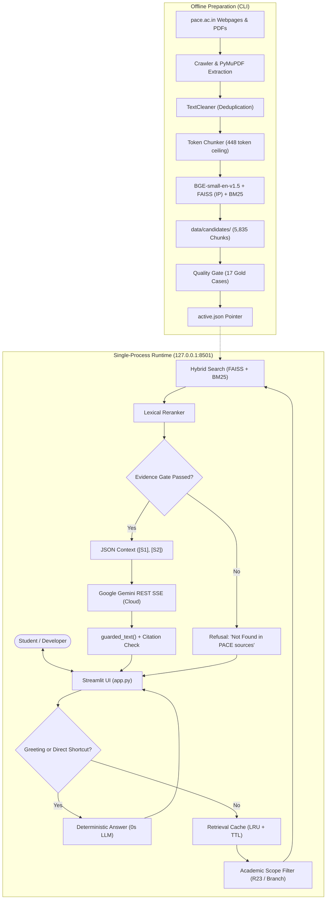

# PACE AI — Intelligent Campus Information Assistant

[](https://www.python.org/downloads/release/python-3119/)
[](https://streamlit.io/)
[](tests/)
[](docs/ARCHITECTURE.md)
[](https://pace.ac.in/)

**PACE AI** is an evidence-grounded, private campus assistant built for students, faculty, and visitors of **PACE Institute of Technology and Sciences** (Valluru, Ongole, Andhra Pradesh).

It provides factual, cited answers to queries regarding academic regulations (`R23`, `R21`, `R18`), department syllabi, admissions, campus amenities, placements, and examinations by retrieving verified excerpts directly from public `pace.ac.in` webpages and official academic PDFs.

---

## 1. Problem Being Solved

Institutional campus information is frequently scattered across disparate web subpages, dynamic menus, and hundred-page PDF circulars. Students often struggle to locate:
- Specific semester course codes, credit allocations, and subject outlines.
- Academic autonomy regulations (`R23`, `R21`) versus outdated curriculum tables.
- Specific campus facilities, hostel regulations, and placement statistics.

**PACE AI resolves this challenge** by building an offline, token-budgeted, searchable knowledge base of official PACE documentation and answering questions through a responsive, evidence-backed conversational interface.

---

## 2. Key Capabilities & Current Limitations

### Key Capabilities
- **Grounded Hybrid Retrieval**: Integrates **FAISS dense semantic search** (384-d BGE vectors) with **Rank-BM25 lexical search** for exact campus keywords and course codes.
- **Academic Branch & Regulation Scoping**: Automatically detects branch specializations (e.g., `AIML`, `CSE`, `ECE`) and regulations (e.g., `R23`), restricting retrieval before search runs to prevent mixing unrelated regulations.
- **Token-Aware Chunking (448 Tokens)**: All 5,835 chunks are strictly budgeted against the complete embedding input (metadata + text), guaranteeing zero silent token-window truncation.
- **Strict Citation Attributions**: Every factual answer is linked directly to official PACE source cards, complete with **exact PDF page numbers** (`[S1]`, `[S2]`).
- **Hallucination Prevention**: Enforces a strict dual-score evidence gate. If supporting PACE documents do not exist, the assistant refuses safely instead of hallucinating.
- **Deterministic Shortcuts**: Casual greetings and syllabus overviews run deterministically without contacting the LLM, ensuring instant (<20 ms) responses at zero API cost.
- **Safe Candidate Snapshot Promotion**: Search indexes use immutable candidate directories with SHA-256 manifests and atomic 1-click rollback.

### Current Limitations
- **Localhost Execution Only**: Binds strictly to `127.0.0.1`. No public deployment or reverse proxy is configured out of the box.
- **Single-Process Model**: Runs in a single Python process with a non-blocking generation lock. Concurrent queries in separate tabs are queued/rejected.
- **No User Authentication**: No student login, role-based access control, or user accounts.
- **No Document Uploads**: Users cannot upload personal PDFs or notes; all knowledge originates from official crawled PACE sources.
- **Transient Chat History**: Conversations reside in Streamlit session memory and reset upon browser refresh.
- **No Automatic Web Scraping**: The app does not scrape in the background; indexing is an explicit offline CLI command.

---

## 3. Architecture Overview

PACE AI is designed as a **single Python application process** combining the Streamlit frontend and the RAG orchestrator:



*For complete architectural specifications, see [`docs/ARCHITECTURE.md`](docs/ARCHITECTURE.md).*

---

## 4. Technology Stack

| Category | Package / Tool | Version | Purpose in PACE AI |
| :--- | :--- | :--- | :--- |
| **Core Runtime** | `python` | `3.11.9` | Primary runtime engine (C-extension binary compatibility). |
| | `streamlit` | `1.63.0` | Dark-themed, responsive student workspace with Spotlight hover effects. |
| | `python-dotenv` | `1.2.3` | Centralized environment configuration loader. |
| **Retrieval & Embeddings**| `sentence-transformers`| `5.7.0` | Loads `BAAI/bge-small-en-v1.5` dense embedding model (384 dimensions). |
| | `faiss-cpu` | `1.15.0` | Vector similarity engine (`IndexFlatIP` on normalized vectors = Cosine Similarity). |
| | `rank-bm25` | `0.2.2` | Lexical inverted index for exact course codes (`R23`, `P23MC01`, `CSE`, `ECE`). |
| **Offline Ingestion** | `requests` | `2.34.2` | Polite web crawling with SSRF protection and redirect inspection. |
| | `beautifulsoup4` | `4.15.0` | HTML content extraction, tag stripping, and title/heading parsing. |
| | `PyMuPDF` (fitz) | `1.28.2` | High-fidelity digital text and page-number extraction from academic PDFs. |
| | `langchain-text-splitters`| `1.1.2` | Character-level recursive text splitting utilities. |
| **Generation (Cloud)** | `requests` | `2.34.2` | Direct streaming HTTP SSE client to Google Gemini REST API (`gemini-3.5-flash`). |
| **Embedding runtime** | `transformers` | `5.16.1` | Model loading support required by `sentence-transformers`. |
| | `torch` | `2.14.0` | Tensor runtime used to compute local BGE query embeddings. |
| **Testing & Quality** | `pytest` | `9.1.1` | Automated testing framework powering the 89 offline unit/regression tests. |

---

## 5. Quick Start & Installation

### Prerequisites
- **Python 3.11** installed and on your PATH.
- Windows 10/11 (PowerShell), macOS, or Linux.

### 1. Setup Virtual Environment
Open PowerShell in the project directory:

```powershell
cd "C:\Users\Purna\OneDrive\Desktop\PACE AI\pace-ai-assistant"
python -m venv .venv
.\.venv\Scripts\Activate.ps1
```
*(If script execution is disabled in PowerShell: `Set-ExecutionPolicy -Scope Process -ExecutionPolicy Bypass`, then re-run activation).*

### 2. Install Dependencies
```powershell
python -m pip install --upgrade pip
python -m pip install -r requirements.txt
```

### 3. Configure Gemini API Key
Copy the configuration template:
```powershell
Copy-Item .env.example .env
```
Open `.env` and set your key:
```dotenv
PACE_LLM_PROVIDER=gemini
PACE_GEMINI_MODEL=gemini-3.5-flash
GEMINI_API_KEY=your_key_here
```
> [!IMPORTANT]
> `.env` contains your private credentials and is strictly ignored by Git. Never commit or expose this file.

### 4. Verify Search Index & Start the App
Select the evaluated token-aware candidate index (5,835 chunks):
```powershell
python select_index.py --candidate data/candidates/token-448-20260912-v3
```

Start the Streamlit interface:
```powershell
streamlit run app.py
```
*(Alternatively, execute the PowerShell helper script: `.\start.ps1`)*

Open your browser at: **`http://127.0.0.1:8501`**

### 5. Free Streamlit Community Cloud deployment

The repository includes the evaluated `token-448-20260912-v3` snapshot required
at runtime. Deploy `app.py` from the `main` branch using Python 3.11. In the
Streamlit Community Cloud Secrets panel, configure the key outside GitHub:

```toml
GEMINI_API_KEY = "your-rotated-key"
PACE_LLM_PROVIDER = "gemini"
PACE_GEMINI_MODEL = "gemini-3.5-flash"
```

Do not run `build_index.py` during cloud startup. Index construction remains an
offline, evaluated workflow. The deployed application uses Gemini; no Qwen model
or `llama.cpp` package is installed or selected.

*For a complete installation walkthrough, see [`docs/SETUP.md`](docs/SETUP.md).*

---

## 6. Project Structure

```text
pace-ai-assistant/
├── app.py                      # Main Streamlit chat application
├── build_index.py              # Single-command offline knowledge ingestion
├── select_index.py             # CLI for candidate index activation & rollback
├── ask.py                      # CLI tool to test queries without launching the UI
├── start.ps1                   # Verified Windows PowerShell startup helper
├── config.py                   # Central Settings dataclass and environment loader
├── requirements.txt            # Pinned dependencies with CPU wheel flags
├── .env.example                # Configuration template with safe placeholders
├── assets/                     # UI styling, institutional crest, spotlight scripts
│   ├── pace-logo.jpg           # Official PACE Institute crest
│   ├── ui.css                  # Custom responsive dark-theme stylesheet
│   └── spotlight.js            # Hover spotlight interaction script
├── src/                        # Core Python application modules
│   ├── academic_query.py       # Branch (AIML, CSE) & regulation (R23) parser
│   ├── answer_policy.py        # Greetings routing, 3x repetition guard, sentence buffer
│   ├── bm25_search.py          # Rank-BM25 lexical index with field weighting
│   ├── chunker.py              # Base document chunking class
│   ├── cleaner.py              # HTML noise removal & provenance-preserving dedup
│   ├── crawler.py              # Polite priority crawler for pace.ac.in
│   ├── embedding_text.py       # Canonical embedding representation (metadata + text)
│   ├── embeddings.py           # BGE-small-en-v1.5 model wrapper with L2 normalization
│   ├── index_selection.py      # Candidate activation, SHA-256 manifests & rollback
│   ├── llm.py                  # Gemini REST streaming and grounded-answer safeguards
│   ├── pdf_loader.py           # PyMuPDF page extractor with size & magic byte checks
│   ├── public_http.py          # SSRF prevention, host whitelist & redirect validator
│   ├── rag_pipeline.py         # Grounded RAG orchestrator, context builder & evidence gate
│   ├── reranker.py             # Lexical reranker with title & metadata coverage
│   ├── retriever.py            # Hybrid FAISS + BM25 retriever with LRU/TTL cache
│   ├── runtime.py              # Cached pipeline initialization & index validation
│   ├── token_chunker.py        # Token-aware chunker (448 complete input limit)
│   ├── ui.py                   # UI helper routines, HTML escaping & spotlight cards
│   ├── utils.py                # URL normalizer, content hashing, JSON atomic save
│   └── vector_store.py         # FAISS IndexFlatIP cosine similarity manager
├── tests/                      # Automated test suite and manual verification scripts
│   ├── retrieval_cases.json    # 17 gold acceptance cases for candidate promotion
│   ├── evaluate_token_index.py # Safety & regression gate for candidate indexes
│   ├── manual_retrieval_check.py # Offline retrieval acceptance test (11 queries)
│   ├── manual_corpus_audit.py  # Offline token window & word length diagnostics
│   ├── manual_fix_check.py     # Live Gemini acceptance check (consumes API quota)
│   └── test_*.py               # 13 automated test modules (89 passing tests)
├── data/                       # Local data storage (raw, cleaned, candidates, active)
│   ├── index/                  # Active index pointer (active.json) & baseline files
│   └── candidates/             # Isolated candidate snapshots (token-448-20260912-v3)
└── docs/                       # Comprehensive documentation guides
```

---

## 7. Operational Workflows

### Candidate Ingestion & Evaluation Workflow
Offline indexing guarantees that running queries are never disrupted:

```powershell
# Re-evaluate current active candidate index against 17 gold test cases
python -m tests.evaluate_token_index --output data/candidates/token-448-20260912-v3 --evaluate-only

# Promote candidate to active status
python select_index.py --candidate data/candidates/token-448-20260912-v3

# Rollback immediately to baseline index if needed
python select_index.py --rollback
```

*For detailed indexing instructions, see [`docs/INDEXING.md`](docs/INDEXING.md).*

---

## 8. Verification & Testing

The test suite runs **100% offline** (excluding `manual_fix_check.py`) and requires **zero Gemini quota**:

```powershell
# Run the complete automated test suite (89 tests)
.\.venv\Scripts\pytest -v

# Run syntax compilation check across all modules
.\.venv\Scripts\python -m compileall src config.py app.py tests
```

*Current Verified Test Count:* **89 passed in ~19.2 seconds**.

*For complete test documentation, see [`docs/TESTING.md`](docs/TESTING.md).*

---

## 9. Security & Privacy Summary

- **SSRF Defense**: Requests are restricted to `pace.ac.in` and `www.pace.ac.in` on standard ports (80/443).
- **Credential Protection**: API keys are passed exclusively via HTTP headers (`x-goog-api-key`). Error handlers sanitize provider codes to prevent credential leakage.
- **Localhost Bound**: The server binds to `127.0.0.1`, keeping the app isolated from the local network.
- **Input & Output Sanitization**: Source card metadata is escaped with `html.escape()`. Generated sentences are monitored for repetition loops.

*For threat models and limitations, see [`docs/SECURITY.md`](docs/SECURITY.md).*

---

## 10. Complete Documentation Sitemap

| Guide | Description |
| :--- | :--- |
| [`docs/ARCHITECTURE.md`](docs/ARCHITECTURE.md) | In-depth system design, component reference table, and Mermaid architecture diagrams. |
| [`docs/WORKFLOW.md`](docs/WORKFLOW.md) | 15-stage system lifecycle, 3 answering pathways, and Mermaid sequence diagrams. |
| [`docs/SETUP.md`](docs/SETUP.md) | Beginner-friendly installation guide for Windows PowerShell and cross-platform systems. |
| [`docs/CONFIGURATION.md`](docs/CONFIGURATION.md) | Full reference for all settings in `config.py` and `.env.example`. |
| [`docs/INDEXING.md`](docs/INDEXING.md) | Token-aware chunking (448), FAISS/BM25 builds, candidate manifests, and rollback. |
| [`docs/TESTING.md`](docs/TESTING.md) | Test suite taxonomy, running 89 unit tests, and offline diagnostic scripts. |
| [`docs/SECURITY.md`](docs/SECURITY.md) | Threat modeling, SSRF defenses, API key safety, and public deployment risks. |
| [`docs/TROUBLESHOOTING.md`](docs/TROUBLESHOOTING.md) | Actionable solutions for setup, Gemini API, indexing, and runtime errors. |
| [`docs/DEPLOYMENT.md`](docs/DEPLOYMENT.md) | Verified localhost operation and production readiness gap analysis (auth, TLS, proxy). |
| [`docs/ROADMAP.md`](docs/ROADMAP.md) | Current capabilities vs. planned future work (automated refresh, OCR, NLI entailment). |
| [`docs/CONTRIBUTING.md`](docs/CONTRIBUTING.md) | Guidelines for students and developers contributing code, tests, or documentation. |

### Preserved Historical Audit Reports
- [`OPTIMIZATION_REPORT.md`](OPTIMIZATION_REPORT.md): Historical audit report detailing baseline architecture, retrieval optimizations, and security fixes.
- [`TOKEN_CHUNKING_REPORT.md`](TOKEN_CHUNKING_REPORT.md): Follow-up audit report documenting the transition to token-aware chunking and candidate index activation.
- [`PROJECT_NOTES.md`](PROJECT_NOTES.md): Permanent institutional and UI design guidelines.

---

## 11. Future Roadmap

Planned enhancements (currently unimplemented) include:
- **Safe Automated Knowledge Refreshes**: Periodic background crawlers that inspect HTTP ETags and rebuild candidate indexes automatically.
- **OCR Engine for Scanned Circulars**: Optical character recognition for non-digital image PDFs.
- **Natural Language Inference (NLI)**: Formal premise-hypothesis entailment validation on citations.
- **Institutional SSO / Authentication**: Integration with PACE roll numbers and student portals.

*For complete details, see [`docs/ROADMAP.md`](docs/ROADMAP.md).*
