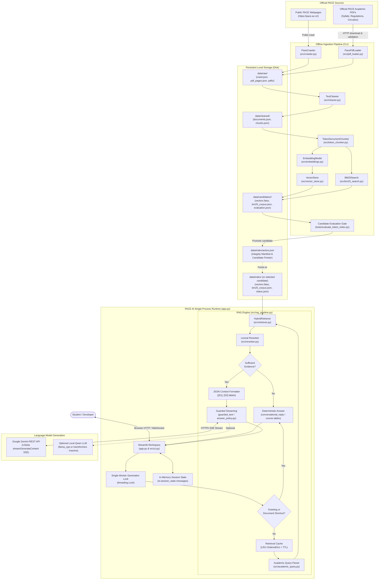
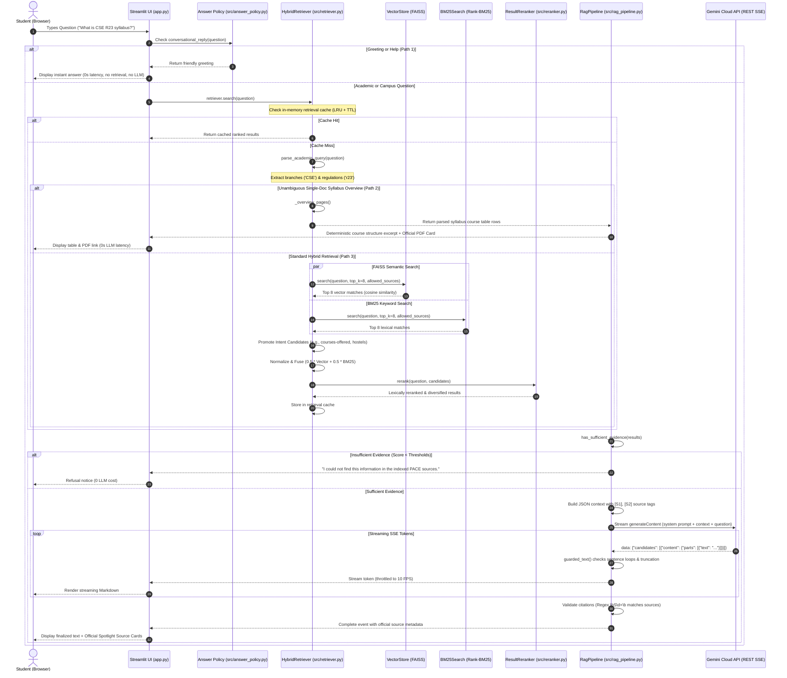
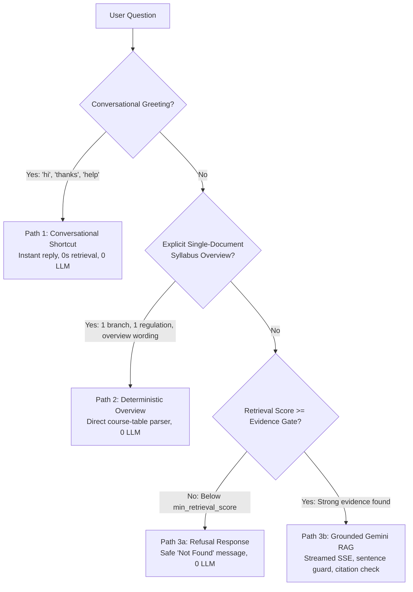

# PACE AI — System Architecture

This document provides an exhaustive technical reference for the architecture of **PACE AI**, an intelligent campus information assistant for **PACE Institute of Technology and Sciences** (Valluru, Ongole, Andhra Pradesh).

---

## 1. Architectural Philosophy & Principles

PACE AI is engineered as an evidence-grounded, privacy-first Retrieval-Augmented Generation (RAG) system. Its design is governed by five foundational architectural principles:

1. **Single-Process Simplicity**: There is no separate frontend/backend API boundary (no FastAPI, Flask, or Express microservices) and no relational database (no PostgreSQL, SQLite, or MongoDB). Streamlit and the RAG engine execute in a single Python process.
2. **Offline Ingestion vs. Online Query Separation**: The web crawler, PDF parser, text cleaner, and index builder run entirely offline via CLI commands. Asking questions in the UI *never* triggers web crawling, file downloads, or vector re-indexing.
3. **Strict Academic Provenance**: Every searchable chunk retains its original source URL, document type, and PDF page number. Chunk text deduplication preserves separate document provenance so that identical policies or syllabus passages in different files remain attributable.
4. **Multi-Gate Hallucination Defense**: Answers are protected by three defense layers:
   - *Academic Scope Filtering*: Questions about specific regulations (e.g., `R23`) or branches (e.g., `AIML`) are restricted to matching documents before vector search runs.
   - *Dual Evidence Gate*: Queries with weak retrieval scores are refused (`"I could not find this information in the indexed PACE sources."`) without contacting the LLM.
   - *Deterministic Shortcuts*: Common greetings and syllabus course structures are resolved deterministically without LLM inference.
5. **Safe Credential Handling**: Gemini API credentials are stored strictly on the server in `.env` (never checked into Git), transmitted exclusively via HTTP request headers (`x-goog-api-key`), and never logged or exposed to the browser.

---

## 2. High-Level System Architecture

The following diagram illustrates the boundary between the offline data preparation pipeline, the runtime application process, and external services:



---

## 2. Offline Ingestion Architecture

The offline ingestion pipeline transforms unstructured public website content and academic PDFs into an immutable, versioned, checksum-verified candidate search index.

```mermaid
flowchart TD
    A["Target: https://pace.ac.in/"] --> B["PaceCrawler (src/crawler.py)"]
    B -->|Check robots.txt, politeness delay (0.75s)| C{"Is valid PACE URL?"}
    C -->|No / External| D[Drop Link]
    C -->|Yes: HTML| E["Extract text & metadata with BeautifulSoup"]
    C -->|Yes: PDF URL| F["Queue in pdf_urls (Priority Weighted)"]
    
    E --> G["data/raw/crawl.json"]
    F --> H["PacePdfLoader (src/pdf_loader.py)"]
    H -->|Validate host, size <40MB, %PDF header| I["Download to .pdf.part -> atomic rename"]
    I --> J["Extract page text & page numbers with PyMuPDF"]
    J --> K["data/raw/pdf_pages.json"]
    
    G & K --> L["TextCleaner (src/cleaner.py)"]
    L -->|Filter site noise & repeated lines across docs| M["Provenance-Preserving Deduplication"]
    M --> N["data/cleaned/documents.json"]
    
    N --> O["TokenDocumentChunker (src/token_chunker.py)"]
    O -->|Token budget: Complete input <= 448 tokens| P["Keep table rows intact; carry semester headings"]
    P --> Q["data/cleaned/chunks.json (5,835 chunks)"]
    
    Q --> R["EmbeddingModel (src/embeddings.py)"]
    R -->|BAAI/bge-small-en-v1.5 (384-d)| S["Normalize L2 vectors"]
    S --> T["VectorStore (src/vector_store.py) -> vectors.faiss (IndexFlatIP)"]
    
    Q --> U["BM25Search (src/bm25_search.py)"]
    U -->|Field-weighted tokenization: title x4, url x4, dept x3| V["bm25_corpus.json"]
    
    T & V --> W["Candidate Index Directory: data/candidates/<name>/"]
    W --> X["evaluate_token_index.py (17 test cases, 0 regressions)"]
    X --> Y["Generate evaluation.json & SHA256 Manifest"]
    Y --> Z["select_index.py --candidate -> updates data/index/active.json"]
```

### Ingestion Components & Behavior

| Component | Source File | Core Responsibility | Failure & Safety Behavior |
| :--- | :--- | :--- | :--- |
| **`validate_public_url`** | [`src/public_http.py`](file:///C:/Users/Purna/OneDrive/Desktop/PACE%20AI/pace-ai-assistant/src/public_http.py) | Enforces that URLs belong strictly to `pace.ac.in` or `www.pace.ac.in`, HTTP/HTTPS only, standard ports (80/443), no user credentials. | Raises `InvalidURL`. Prevents SSRF attacks. |
| **`public_get`** | [`src/public_http.py`](file:///C:/Users/Purna/OneDrive/Desktop/PACE%20AI/pace-ai-assistant/src/public_http.py) | Executes requests with redirect inspection (max 3 hops), disallows HTTPS-to-HTTP downgrade. | Raises `TooManyRedirects` or `InvalidURL`. |
| **`PaceCrawler`** | [`src/crawler.py`](file:///C:/Users/Purna/OneDrive/Desktop/PACE%20AI/pace-ai-assistant/src/crawler.py) | Crawls public HTML pages up to `max_pages` (120) and `max_depth` (3). Prioritizes academic links (`r23`, `syllabus`, `admission`). | Skips errors; logs warnings without crashing. |
| **`PacePdfLoader`** | [`src/pdf_loader.py`](file:///C:/Users/Purna/OneDrive/Desktop/PACE%20AI/pace-ai-assistant/src/pdf_loader.py) | Downloads PDFs up to `max_pdf_mb` (40 MB). Validates magic byte header (`%PDF`). Extracts text page-by-page via PyMuPDF. | Unlinks temporary `.pdf.part` files on error. Never saves corrupt partial PDFs. |
| **`TextCleaner`** | [`src/cleaner.py`](file:///C:/Users/Purna/OneDrive/Desktop/PACE%20AI/pace-ai-assistant/src/cleaner.py) | Eliminates cookie notices, navigation headers/footers, and lines repeated across >25% of documents. Deduplicates identical pages. | Retains `source_url` and `page` so identical texts in separate files do not overwrite each other. |
| **`TokenDocumentChunker`**| [`src/token_chunker.py`](file:///C:/Users/Purna/OneDrive/Desktop/PACE%20AI/pace-ai-assistant/src/token_chunker.py)| Chunks text budgeted against the complete embedding input (`chunk_token_limit` = 448). Keeps table lines intact; carries semester headings. | Raises `ValueError` if a single line cannot fit. Zero silent truncation. |
| **`EmbeddingModel`** | [`src/embeddings.py`](file:///C:/Users/Purna/OneDrive/Desktop/PACE%20AI/pace-ai-assistant/src/embeddings.py) | Generates dense vectors using `BAAI/bge-small-en-v1.5`. Prefixes queries with BGE search prompt. Normalizes vectors to unit length. | Raises `ValueError` if any text exceeds 512 tokens. Caches model locally in `data/cache/models/`. |
| **`VectorStore`** | [`src/vector_store.py`](file:///C:/Users/Purna/OneDrive/Desktop/PACE%20AI/pace-ai-assistant/src/vector_store.py) | Builds FAISS `IndexFlatIP` (Inner Product on normalized vectors = Cosine Similarity). Writes atomically via `.tmp` swap. | Rejects builds with missing chunks. Verifies count matches. |
| **`BM25Search`** | [`src/bm25_search.py`](file:///C:/Users/Purna/OneDrive/Desktop/PACE%20AI/pace-ai-assistant/src/bm25_search.py) | Builds BM25Okapi inverted index over weighted metadata strings (title, section, category, department, text). | Saves tokens and chunks to `bm25_corpus.json`. |

---

## 3. Question-Answering Runtime Architecture

During user interaction, the entire query resolution pipeline operates strictly on pre-computed local files and cloud generation.



---

## 4. Three Distinct Answering Pathways

The RAG pipeline deliberately avoids invoking Gemini whenever a reliable, deterministic answer can be provided:



1. **Path 1: Conversational Shortcut (`conversational_reply`)**
   - *Triggers on*: Basic greetings (`"hello"`, `"good morning"`), expressions of gratitude (`"thank you"`), and general capability queries (`"help"`).
   - *Action*: Returns hardcoded student-friendly text directly from [`src/answer_policy.py`](file:///C:/Users/Purna/OneDrive/Desktop/PACE%20AI/pace-ai-assistant/src/answer_policy.py).
   - *Cost & Latency*: <1 ms, zero model loading, zero network traffic.

2. **Path 2: Deterministic Document Navigation / Syllabus Overview (`_direct_answer`)**
   - *Triggers on*: Queries explicitly asking for a syllabus overview for a single branch and regulation (e.g., `"tell me the syllabus of aiml in r23 regulation"`), or broad course overviews.
   - *Action*: Extracts structured table rows directly from PyMuPDF page text using regex (`Year ... Semester` and course code patterns), formats the subject list with explicit partial coverage notes, and attaches the official PDF source card.
   - *Cost & Latency*: ~20 ms retrieval, zero LLM calls, zero hallucination risk.

3. **Path 3: Grounded Gemini RAG Generation**
   - *Triggers on*: Specific factual campus questions (e.g., `"What placement services are offered?"`, `"What are the hostel rules?"`).
   - *Action*: Evaluates evidence score -> Formats JSON context with `[S1]`, `[S2]` labels -> Calls Gemini REST API via HTTP streaming -> Verifies sentence quality and source citations -> Renders answer with clickable source cards.

---

## 5. Comprehensive Component Reference Table

| Module / File | Primary Class / Function | Runtime Stage | Inputs | Outputs | Failure Behavior |
| :--- | :--- | :--- | :--- | :--- | :--- |
| [`config.py`](file:///C:/Users/Purna/OneDrive/Desktop/PACE%20AI/pace-ai-assistant/config.py) | `Settings` | Startup / All | Environment variables, `.env` | Immutable frozen dataclass | Falls back to verified safe defaults. |
| [`src/public_http.py`](file:///C:/Users/Purna/OneDrive/Desktop/PACE%20AI/pace-ai-assistant/src/public_http.py) | `validate_public_url`, `public_get` | Ingestion | URL, Session, timeout | `requests.Response` | Raises `InvalidURL` or `TooManyRedirects` if host/redirect untrusted. |
| [`src/crawler.py`](file:///C:/Users/Purna/OneDrive/Desktop/PACE%20AI/pace-ai-assistant/src/crawler.py) | `PaceCrawler.crawl()` | Ingestion | `base_url`, limits | `crawl.json` dict | Logs HTTP errors, continues to next URL. |
| [`src/pdf_loader.py`](file:///C:/Users/Purna/OneDrive/Desktop/PACE%20AI/pace-ai-assistant/src/pdf_loader.py) | `PacePdfLoader.load_many()` | Ingestion | Discovered PDF URLs | `pdf_pages.json` dict | Deletes partial `.pdf.part` files; skips corrupt PDFs. |
| [`src/cleaner.py`](file:///C:/Users/Purna/OneDrive/Desktop/PACE%20AI/pace-ai-assistant/src/cleaner.py) | `TextCleaner.clean()` | Ingestion | Raw pages & PDF docs | Cleaned documents dict | Drops pages with <5 words after cleaning. |
| [`src/token_chunker.py`](file:///C:/Users/Purna/OneDrive/Desktop/PACE%20AI/pace-ai-assistant/src/token_chunker.py) | `TokenDocumentChunker.chunk()` | Ingestion | Cleaned documents | Chunks dict (max 448 tokens) | Raises `ValueError` on oversized lines or insufficient budget. |
| [`src/embeddings.py`](file:///C:/Users/Purna/OneDrive/Desktop/PACE%20AI/pace-ai-assistant/src/embeddings.py) | `EmbeddingModel.encode_documents()` | Ingestion | Chunk text list | NumPy `float32` matrix (N, 384) | Raises `ValueError` if input exceeds 512 tokens. |
| [`src/vector_store.py`](file:///C:/Users/Purna/OneDrive/Desktop/PACE%20AI/pace-ai-assistant/src/vector_store.py) | `VectorStore.build()` / `search()` | Both | Chunks / Query string | `vectors.faiss` / Matched chunks | Raises `FileNotFoundError` if index missing on disk. |
| [`src/bm25_search.py`](file:///C:/Users/Purna/OneDrive/Desktop/PACE%20AI/pace-ai-assistant/src/bm25_search.py) | `BM25Search.build()` / `search()` | Both | Chunks / Query string | `bm25_corpus.json` / Scored chunks | Returns empty list if question has no token overlap. |
| [`src/academic_query.py`](file:///C:/Users/Purna/OneDrive/Desktop/PACE%20AI/pace-ai-assistant/src/academic_query.py) | `parse_academic_query()` | Runtime Query | Raw query string | `AcademicQuery` dataclass | Defaults to unscoped query if no patterns match. |
| [`src/retriever.py`](file:///C:/Users/Purna/OneDrive/Desktop/PACE%20AI/pace-ai-assistant/src/retriever.py) | `HybridRetriever.search()` | Runtime Query | User question, `top_k` | Diversified ranked chunk list | Returns empty results if question exceeds 1500 chars. |
| [`src/reranker.py`](file:///C:/Users/Purna/OneDrive/Desktop/PACE%20AI/pace-ai-assistant/src/reranker.py) | `ResultReranker.rerank()` | Runtime Query | Question, Candidate list | Reranked chunk list | Falls back to unranked scores if candidates empty. |
| [`src/rag_pipeline.py`](file:///C:/Users/Purna/OneDrive/Desktop/PACE%20AI/pace-ai-assistant/src/rag_pipeline.py) | `RagPipeline.stream()` | Runtime Query | User question | Event generator (`token`, `complete`) | Yields `quality_fallback` if stream repeats or drops labels. |
| [`src/answer_policy.py`](file:///C:/Users/Purna/OneDrive/Desktop/PACE%20AI/pace-ai-assistant/src/answer_policy.py) | `guarded_text()` | Runtime Query | Token iterator | Sentence iterator | Raises `AnswerQualityError` on 3x phrase repetition or truncation. |
| [`src/llm.py`](file:///C:/Users/Purna/OneDrive/Desktop/PACE%20AI/pace-ai-assistant/src/llm.py) | `GeminiLLM.stream_with_usage()`| Runtime Query | Prompt, telemetry dict | Token iterator | Maps HTTP 400/401/403/429 to safe `LLMServiceError`. |
| [`src/index_selection.py`](file:///C:/Users/Purna/OneDrive/Desktop/PACE%20AI/pace-ai-assistant/src/index_selection.py) | `activate()`, `rollback()` | Admin CLI | Candidate path | `active.json` manifest | Rejects un-evaluated, corrupted, or altered candidates. |
| [`src/ui.py`](file:///C:/Users/Purna/OneDrive/Desktop/PACE%20AI/pace-ai-assistant/src/ui.py) | `source_cards()`, `backend()` | Runtime UI | Source list, selection | HTML string, cached pipeline | Escapes HTML; drops links outside `pace.ac.in`. |

---

## 6. What is Explicitly NOT in the Architecture

To prevent architectural misunderstandings, the following capabilities are explicitly **absent** from the current codebase:

- **No Separate REST API Server**: There is no FastAPI or Flask backend running alongside Streamlit.
- **No Database Engine**: No SQLite, PostgreSQL, MySQL, or MongoDB database exists. All state resides in JSON files, FAISS binary files, or in-memory session dictionaries.
- **No User Accounts or Authentication**: The application has no login screen, no session tokens, and no role-based access control (RBAC).
- **No Document Upload Functionality**: Students and users cannot upload custom PDFs or notes through the browser. All content is ingested from official PACE public domains.
- **No Persistent Chat History**: Chat messages exist only in `st.session_state.messages`. Refreshing the browser tab clears the conversation history.
- **No Automatic Background Web Scraping**: The app does not scrape the website automatically. Knowledge base refreshes are executed manually using CLI tools.
