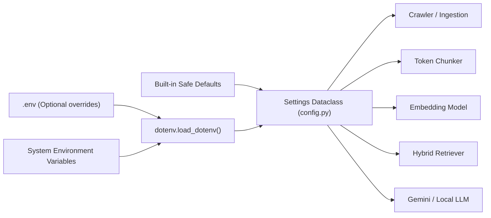

# PACE AI — Configuration Reference

This document provides a comprehensive reference for all configuration options supported by PACE AI. Settings are defined in [`config.py`](file:///C:/Users/Purna/OneDrive/Desktop/PACE%20AI/pace-ai-assistant/config.py) and can be overridden via environment variables or a local `.env` file based on [`.env.example`](file:///C:/Users/Purna/OneDrive/Desktop/PACE%20AI/pace-ai-assistant/.env.example).

---

## 1. Configuration Flow

At application startup, `config.py` resolves the project root, loads `.env` if present, and creates an immutable, frozen `Settings` object (`config.settings`).

---

## 2. Setting Categories

### A. Web Crawling Settings

Controls polite website crawling when running `build_index.py` or `src/crawler.py`.

| Variable Name | Default Value | Type | Purpose | Security Implications | Rebuild / Restart? |
| :--- | :--- | :--- | :--- | :--- | :--- |
| `PACE_BASE_URL` | `https://pace.ac.in/` | URL string | Seed URL for web crawling. | Restricted to `pace.ac.in` and `www.pace.ac.in` in `public_http.py` to prevent SSRF. | Rebuild required. |
| `PACE_USER_AGENT` | `PACE-AI-Academic-Assistant/1.0 (+https://pace.ac.in/)` | String | HTTP User-Agent header identifying crawler requests. | Informs web administrators of automated indexing. | Rebuild required. |
| `PACE_REQUEST_TIMEOUT` | `20` | Integer | HTTP connection and read timeout (in seconds). | Prevents crawler worker hanging indefinitely on slow sockets. | Rebuild required. |
| `PACE_REQUEST_DELAY` | `0.75` | Float | Delay (in seconds) between successive requests to `pace.ac.in`. | Politeness control; prevents overloading the campus web server. | Rebuild required. |
| `PACE_MAX_PAGES` | `120` | Integer | Maximum number of HTML pages to fetch during a crawl. | Bounds crawler scope and local disk utilization. | Rebuild required. |
| `PACE_MAX_DEPTH` | `3` | Integer | Maximum hyperlink depth from the base URL. | Prevents crawler from wandering into recursive link traps. | Rebuild required. |

---

### B. PDF Ingestion & Limits

Controls PDF downloading and text extraction via `src/pdf_loader.py`.

| Variable Name | Default Value | Type | Purpose | Security Implications | Rebuild / Restart? |
| :--- | :--- | :--- | :--- | :--- | :--- |
| `PACE_MAX_PDFS` | `80` | Integer | Maximum number of academic PDFs to download and extract. | Bounds disk space and PyMuPDF processing time. | Rebuild required. |
| `PACE_MAX_PDF_MB` | `40` | Integer | Maximum allowable size per PDF in megabytes. | Prevents resource exhaustion from oversized files or zip bombs. Validates Content-Length and stream bytes. | Rebuild required. |

---

### C. Text Chunking & Token Budgeting

Controls chunk boundary generation in `src/token_chunker.py` and `src/chunker.py`.

| Variable Name | Default Value | Type | Purpose | Security Implications | Rebuild / Restart? |
| :--- | :--- | :--- | :--- | :--- | :--- |
| `PACE_CHUNK_TOKEN_LIMIT` | `448` | Integer | Maximum token budget for the *complete embedding input* (metadata + text). | Ensures total text never exceeds the BGE 512-token window. Prevents silent embedding truncation. | Rebuild required. |
| `PACE_CHUNK_TOKEN_OVERLAP` | `48` | Integer | Token overlap between sequential chunks from the same document page. | Maintains semantic continuity across chunk transitions. Must be < `limit // 2`. | Rebuild required. |
| `PACE_CHUNK_SIZE` | `600` | Integer | Legacy word-based chunk size for fallback `DocumentChunker`. | Retained for backward-compatible comparison tests. | Rebuild required. |
| `PACE_CHUNK_OVERLAP` | `100` | Integer | Legacy word-based overlap for fallback `DocumentChunker`. | Retained for backward-compatible comparison tests. | Rebuild required. |

---

### D. Embeddings & Dense Search

Controls local embedding generation in `src/embeddings.py` and FAISS vector storage in `src/vector_store.py`.

| Variable Name | Default Value | Type | Purpose | Security Implications | Rebuild / Restart? |
| :--- | :--- | :--- | :--- | :--- | :--- |
| `PACE_EMBEDDING_MODEL` | `BAAI/bge-small-en-v1.5` | String | Hugging Face model identifier for local semantic embeddings (384-d). | Embeddings run locally on CPU/CUDA. No data sent to third parties. Verified against index manifest. | Rebuild required. |
| `PACE_EMBEDDING_BATCH_SIZE` | `32` | Integer | Batch size passed to SentenceTransformers during offline indexing. | Adjust lower (e.g., 16) if running on low-RAM workstations. | Rebuild required. |

---

### E. Hybrid Retrieval & Reranking

Controls semantic + lexical search fusion in `src/retriever.py` and `src/reranker.py`.

| Variable Name | Default Value | Type | Purpose | Security Implications | Rebuild / Restart? |
| :--- | :--- | :--- | :--- | :--- | :--- |
| `PACE_VECTOR_TOP_K` | `8` | Integer | Shortlist size retrieved from FAISS cosine search. | Higher values increase recall but slightly increase fusion latency. | Restart app. |
| `PACE_BM25_TOP_K` | `8` | Integer | Shortlist size retrieved from BM25 keyword search. | Ensures exact terms (e.g., course codes, names) are surfaced. | Restart app. |
| `PACE_FINAL_TOP_K` | `4` | Integer | Number of top chunks retained after reranking and diversification. | Feeds into context builder; keeps context concise. | Restart app. |
| `PACE_VECTOR_WEIGHT` | `0.50` | Float | Weight assigned to normalized vector score in linear fusion. | Balance between semantic understanding and keyword match. | Restart app. |
| `PACE_BM25_WEIGHT` | `0.50` | Float | Weight assigned to normalized BM25 score in linear fusion. | Balance between semantic understanding and keyword match. | Restart app. |
| `PACE_MAX_CHUNKS_PER_SOURCE` | `2` | Integer | Maximum chunks allowed from a single document URL in top results. | Source diversification; prevents a single long PDF from dominating context. | Restart app. |
| `PACE_USE_CROSS_ENCODER` | `false` | Boolean | If `true`, runs deep transformer cross-encoder reranking. | Slower CPU inference. Defaults to `false` in favor of fast lexical reranking. | Restart app. |
| `PACE_RERANKER_MODEL` | `cross-encoder/ms-marco-MiniLM-L-6-v2` | String | Model ID for optional cross-encoder reranking. | Downloaded locally if cross-encoder enabled. | Restart app. |

---

### F. Context Construction & Evidence Gating

Controls context injection and hallucination safeguards in `src/rag_pipeline.py`.

| Variable Name | Default Value | Type | Purpose | Security Implications | Rebuild / Restart? |
| :--- | :--- | :--- | :--- | :--- | :--- |
| `PACE_MIN_RETRIEVAL_SCORE` | `0.35` | Float | Minimum fused score required to consider a chunk as evidence. | High-confidence gate against irrelevant content. | Restart app. |
| `PACE_MIN_VECTOR_EVIDENCE` | `0.58` | Float | Minimum standalone vector score required for evidence. | Prevents purely random semantic associations from passing. | Restart app. |
| `PACE_MIN_LEXICAL_EVIDENCE` | `0.25` | Float | Minimum lexical score required when vector score is moderate. | Protects exact-term queries. | Restart app. |
| `PACE_MAX_CONTEXT_WORDS` | `900` | Integer | Hard word limit for total injected context in Gemini prompt. | Bounds token costs and guarantees focus on top sources. | Restart app. |
| `PACE_MAX_CONTEXT_SOURCES` | `3` | Integer | Maximum distinct source passages included in prompt context. | Focuses answer on top 3 authoritative sources. | Restart app. |

---

### G. Retrieval Result Caching

Controls the thread-safe in-memory cache in `src/retriever.py`.

| Variable Name | Default Value | Type | Purpose | Security Implications | Rebuild / Restart? |
| :--- | :--- | :--- | :--- | :--- | :--- |
| `PACE_RETRIEVAL_CACHE_SIZE` | `128` | Integer | Maximum number of unique queries retained in LRU cache. | Bounded memory consumption; prevents memory leaks on long runs. | Restart app. |
| `PACE_RETRIEVAL_CACHE_TTL` | `300` | Float | Time-to-live (in seconds) for cached retrieval results (5 minutes). | Ensures repeated queries return in <1 ms while expiring periodically. | Restart app. |

---

### H. Gemini Cloud LLM Configuration

Controls cloud generation in `src/llm.py`.

| Variable Name | Default Value | Type | Purpose | Security Implications | Rebuild / Restart? |
| :--- | :--- | :--- | :--- | :--- | :--- |
| `PACE_LLM_PROVIDER` | `llama_cpp` (set to `gemini` in active `.env`) | String | LLM backend selector: `gemini`, `llama_cpp`, or `transformers`. | Controls whether requests go to Google AI or run locally. | Restart app. |
| `PACE_GEMINI_MODEL` | `gemini-3.5-flash` | String | Model ID for Google Gemini REST API. | Checked against regex `gemini-[a-zA-Z0-9.-]+` before request. | Restart app. |
| `GEMINI_API_KEY` | `""` (Empty string) | String | API Key for Google AI Studio. | **HIGH SECURITY**: Must never be committed to Git. Transmitted via HTTP header `x-goog-api-key`. | Restart app. |
| `PACE_GEMINI_MAX_OUTPUT_TOKENS` | `1024` | Integer | Maximum output token limit for Gemini response stream. | Prevents unbounded generation costs. | Restart app. |
| `PACE_GEMINI_TIMEOUT` | `45` | Integer | HTTP read timeout (in seconds) for Gemini SSE stream. | Aborts socket if cloud provider hangs. | Restart app. |

---

### I. Optional Inactive Local LLM Settings

Settings applicable *only* when `PACE_LLM_PROVIDER` is set to `llama_cpp` or `transformers`. When `PACE_LLM_PROVIDER=gemini`, these are completely inactive.

| Variable Name | Default Value | Type | Purpose | Security Implications | Rebuild / Restart? |
| :--- | :--- | :--- | :--- | :--- | :--- |
| `PACE_LLM_MODEL` | `Qwen/Qwen2.5-1.5B-Instruct` | String | Hugging Face model repository ID for `transformers` provider. | Local CPU/CUDA inference. | Restart app. |
| `PACE_LLM_GGUF_REPO` | `Qwen/Qwen2.5-1.5B-Instruct-GGUF` | String | Hugging Face repo for quantized GGUF weights (`llama_cpp`). | Downloaded automatically via `huggingface_hub`. | Restart app. |
| `PACE_LLM_GGUF_FILENAME` | `qwen2.5-1.5b-instruct-q4_k_m.gguf` | String | Specific quantized GGUF weight filename. | 4-bit quantized model for 16 GB CPU machines. | Restart app. |
| `PACE_LLM_CONTEXT_SIZE` | `4096` | Integer | Context window size allocated for `llama_cpp`. | Bounds RAM usage. | Restart app. |
| `PACE_LLM_THREADS` | `8` | Integer | CPU thread allocation for local GGUF inference. | High thread counts may cause CPU contention. | Restart app. |
| `PACE_LLM_MAX_NEW_TOKENS` | `160` | Integer | Generation token limit for local Qwen models. | Bounded short answer length. | Restart app. |

---

### J. Diagnostics & Storage Paths

| Variable Name | Default Value | Type | Purpose | Security Implications | Rebuild / Restart? |
| :--- | :--- | :--- | :--- | :--- | :--- |
| `PACE_DEBUG` | `false` | Boolean | Enables verbose retrieval score metadata in the Streamlit UI. | Allows inspectable score debugging. | Live toggle in UI or restart. |
| *Path: `raw_dir`* | `data/raw` | Path | Storage for raw crawl JSON and downloaded PDFs. | Local filesystem only. | Rebuild required. |
| *Path: `cleaned_dir`*| `data/cleaned` | Path | Storage for cleaned documents and chunk JSONs. | Local filesystem only. | Rebuild required. |
| *Path: `index_dir`* | `data/index` | Path | Storage for active FAISS index, BM25 corpus, and active pointer. | Local filesystem only. | Restart app. |
| *Path: `cache_dir`* | `data/cache` | Path | Local Hugging Face model cache and GGUF files. | Local filesystem only. | Restart app. |

---

## 3. Best Practices for `.env` Management

1. **Keep `.env` Uncommitted**: Verify that `.env` is listed in your `.gitignore`.
2. **Use Relative Overrides**: Only specify variables you intend to override from their default values.
3. **Key Rotation**: If your workstation is shared, rotate your `GEMINI_API_KEY` periodically via [Google AI Studio](https://aistudio.google.com/).
