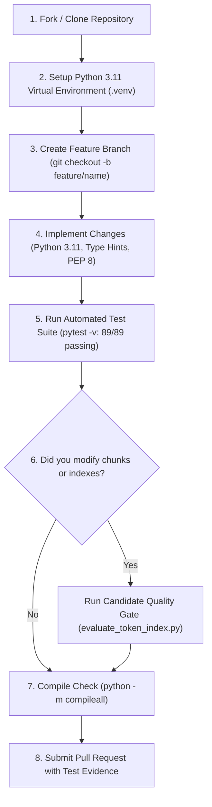

# PACE AI — Developer & Contributor Guide

Welcome to the **PACE AI** contributor guide! This document is designed for students, faculty, and developers who wish to contribute bug fixes, retrieval improvements, or feature enhancements.

---

## 1. Core Contribution Principles

All contributions to PACE AI must adhere to the following non-negotiable rules:

1. **Preserve the Single-Process Architecture**: Do not introduce external REST API frameworks (FastAPI, Flask) or relational databases without explicit architectural consensus.
2. **Never Ingest Inside UI Requests**: Ingestion, crawling, and index builds must remain strictly offline CLI commands. `app.py` must only read pre-computed indexes.
3. **Never Commit Secrets**: Never commit `.env`, API keys, or private data. All configuration must be reflected in `.env.example`.
4. **Enforce Token Limits**: Any change to chunking or metadata must pass the token ceiling check (zero embedding inputs exceeding 512 tokens).
5. **No Regressions**: All 89 existing automated tests must pass cleanly.

---

## 2. Contributor Workflow



---

## 3. Local Development Setup

Follow the steps outlined in [`docs/SETUP.md`](file:///C:/Users/Purna/OneDrive/Desktop/PACE%20AI/pace-ai-assistant/docs/SETUP.md):

```powershell
# 1. Create and activate environment
python -m venv .venv
.\.venv\Scripts\Activate.ps1

# 2. Install dependencies
python -m pip install --upgrade pip
python -m pip install -r requirements.txt

# 3. Create local .env from template
Copy-Item .env.example .env

# 4. Verify existing tests pass
pytest -v
```

---

## 4. Coding & Engineering Standards

- **Python Version**: Strict target is **Python 3.11**.
- **Type Annotations**: All new functions and methods should include standard type annotations (`from __future__ import annotations`).
- **Code Style**: Adhere to PEP 8. Maintain descriptive variable and function names.
- **Docstrings & Comments**: Keep docstrings concise and preserve existing comments explaining critical hardware or token-budget constraints.
- **Error Handling**: Use safe, custom exception classes (such as `LLMServiceError` in `src/llm.py`) so that credentials and raw provider dumps are never leaked.

---

## 5. Testing & Validation Requirements

Before submitting any code, verify all three validation tiers:

### Tier 1: Syntax & Compilation Check
```powershell
python -m compileall src config.py app.py build_index.py select_index.py tests
```
*Must complete with zero errors.*

### Tier 2: Automated Unit & Regression Suite
```powershell
pytest -v
```
*All 89 tests must pass.*

### Tier 3: Index Candidate Evaluation (If Ingestion or Chunking Changed)
If your changes affect [`src/token_chunker.py`](file:///C:/Users/Purna/OneDrive/Desktop/PACE%20AI/pace-ai-assistant/src/token_chunker.py), [`src/cleaner.py`](file:///C:/Users/Purna/OneDrive/Desktop/PACE%20AI/pace-ai-assistant/src/cleaner.py), or [`src/embeddings.py`](file:///C:/Users/Purna/OneDrive/Desktop/PACE%20AI/pace-ai-assistant/src/embeddings.py), you must build and evaluate an isolated candidate:

```powershell
python -m tests.evaluate_token_index --output data/candidates/token-448-contrib-test
```
*Verify that `new_oversized == 0`, `candidate_passed == 17`, and `regressions == []`.*

---

## 6. Pull Request Checklist

Before opening a pull request, ensure you can check off each item:

- [ ] My code follows the project's Python 3.11 coding style.
- [ ] I have not hardcoded any API keys, tokens, or personal paths.
- [ ] My `.env` file remains uncommitted and `.gitignore` is respected.
- [ ] All 89 automated tests pass with `pytest -v`.
- [ ] All Python files pass `python -m compileall`.
- [ ] If I added new retrieval capabilities or branches, I added corresponding test cases in `tests/retrieval_cases.json`.
- [ ] I have documented any new environment variables in `.env.example` and [`docs/CONFIGURATION.md`](file:///C:/Users/Purna/OneDrive/Desktop/PACE%20AI/pace-ai-assistant/docs/CONFIGURATION.md).
