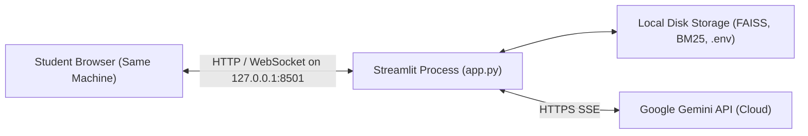
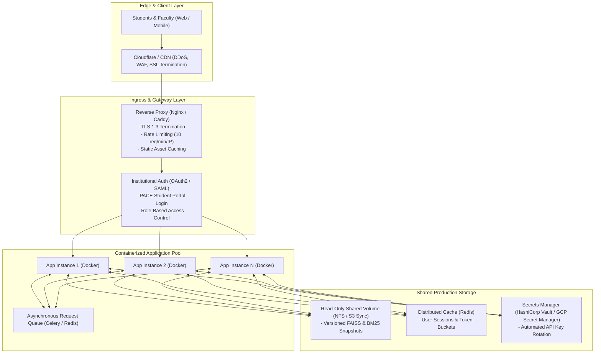

# PACE AI — Local Deployment & Production-Readiness Analysis

This document details the verified local execution environment of PACE AI and provides a comprehensive gap analysis of the architectural enhancements required before exposing the application to public production traffic.

---

## 1. Verified Localhost Deployment (Current Architecture)

The existing PACE AI implementation is verified and tested **strictly for single-machine local execution**:

### Verified Local Deployment Characteristics

- **Host Binding**: Explicitly configured to `127.0.0.1` in `.streamlit/config.toml` and `start.ps1`. Not reachable from external LAN or WAN networks.
- **Process Model**: Single Python process hosting both the UI rendering engine and the RAG pipeline.
- **Concurrency**: Controlled via an in-memory non-blocking lock (`threading.Lock`). Simultaneous requests from multiple tabs are rejected with a busy notice to protect memory.
- **State Storage**: Transient session memory (`st.session_state`) for conversation messages. Static indexes and candidates stored directly on the local filesystem.

---

## 2. Production-Readiness Gap Analysis

To transition PACE AI from a local workstation tool to an institutional, high-availability public service serving thousands of PACE students, the following architectural upgrades must be implemented:

### Required Production Enhancements

> [!IMPORTANT]
> The capabilities below are **not currently implemented** in PACE AI and represent essential prerequisites for public deployment.

| Production Requirement | Current Local State | Production Implementation Plan |
| :--- | :--- | :--- |
| **Authentication & Access Control** | None. Any user on localhost can interact. | Integrate institutional OAuth 2.0 / SAML single sign-on (SSO) tied to PACE student/faculty roll numbers. |
| **Network & TLS Termination** | Plain HTTP on `127.0.0.1:8501`. | Deploy Nginx or Caddy as a reverse proxy with automated Let's Encrypt TLS certificates, HTTP/2, and HSTS headers. |
| **Rate Limiting & DDoS Defense** | None. Unbounded local submissions. | Implement IP-based and user-based token bucket rate limiting (e.g., 5 queries/minute per user) at the reverse proxy or API gateway. |
| **Concurrency & Multi-Worker Scaling** | Single-worker non-blocking `threading.Lock`. | Containerize the application using Docker. Deploy multiple stateless container replicas behind a load balancer with Redis session storage. |
| **Secret Management** | Local `.env` file on disk. | Inject API credentials via enterprise secret managers (Google Secret Manager, AWS Secrets Manager, or HashiCorp Vault) with automated key rotation. |
| **Quota & Cost Guardrails** | Unbounded Gemini cloud calls. | Implement daily student quota budgets, cost monitoring alarms, and fallback to local CPU models if monthly cloud quotas are reached. |
| **Shared Immutable Indexes** | Local `data/candidates/` filesystem paths. | Host validated candidate indexes on high-speed read-only cloud storage (S3 / Google Cloud Storage) synchronized to worker local SSD caches. |
| **Health & Readiness Endpoints** | Built-in basic Streamlit `/_stcore/health`. | Expose formal `/healthz` (liveness) and `/readyz` (readiness) endpoints validating FAISS index integrity and API connectivity. |
| **Observability & Telemetry** | Local console logging and debug expanders. | Instrument pipeline stages with OpenTelemetry, aggregating latencies, error codes, and token usage into Prometheus and Grafana dashboards. |
| **PII Redaction in Logs** | Basic exception name logging without request bodies. | Deploy automated regex log scrubbers ensuring no student roll numbers, phone numbers, or credentials appear in centralized log streams. |
| **Load & Stress Testing** | Single-threaded manual latency checks. | Execute headless load testing with Locust or k6 simulating concurrent exam-day traffic spikes (500+ simultaneous students). |
