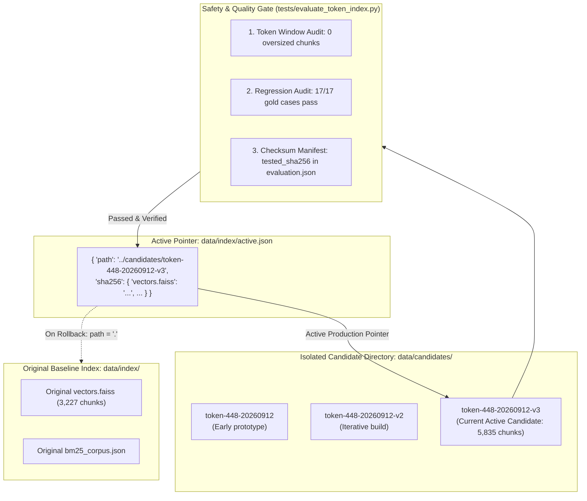
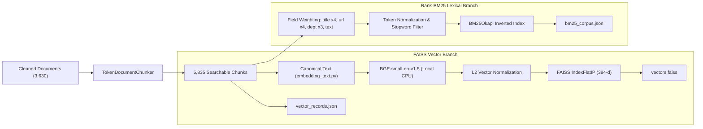

# PACE AI — Indexing, Chunking & Candidate Management

This document explains the ingestion, token-aware chunking, hybrid indexing, evaluation gating, and snapshot management architecture in PACE AI.

---

## 1. Active Index vs. Candidate Index

In PACE AI, **active search indexes are strictly immutable**. Normal user interactions never modify index files on disk.

To achieve safe updates without risking downtime or silent retrieval corruption, PACE AI uses a **Candidate Snapshot Architecture**:



- **Active Index**: The index currently read by [`src/runtime.py`](file:///C:/Users/Purna/OneDrive/Desktop/PACE%20AI/pace-ai-assistant/src/runtime.py). It is determined by [`data/index/active.json`](file:///C:/Users/Purna/OneDrive/Desktop/PACE%20AI/pace-ai-assistant/data/index/active.json). If `active.json` specifies a candidate path, that candidate is loaded. If it specifies `{"path": "."}`, the baseline files in `data/index/` are loaded.
- **Candidate Index**: A newly constructed, fully isolated index residing in `data/candidates/<candidate-name>/`. It contains its own `vectors.faiss`, `vector_records.json`, `bm25_corpus.json`, and `status.json`. It cannot become active until it passes the evaluation gate.

---

## 2. Token-Aware Chunking

### The Token Window Problem

The dense embedding model ([`BAAI/bge-small-en-v1.5`](https://huggingface.co/BAAI/bge-small-en-v1.5)) has a fixed context window of **512 tokens**.
In traditional naive chunkers (e.g., splitting by 600 words), chunks frequently exceed 700+ tokens. Standard transformer libraries silently truncate tokens beyond 512, which means course codes, semester subjects, and prerequisite details appearing at the bottom of long pages are invisibly discarded!

### The Solution: `TokenDocumentChunker`

[`src/token_chunker.py`](file:///C:/Users/Purna/OneDrive/Desktop/PACE%20AI/pace-ai-assistant/src/token_chunker.py) replaces naive character/word chunking with token-aware budgeting:

1. **Complete Embedding Input Budgeting**: Rather than measuring chunk body text alone, the chunker budgets against the *complete canonical embedding input* defined in [`src/embedding_text.py`](file:///C:/Users/Purna/OneDrive/Desktop/PACE%20AI/pace-ai-assistant/src/embedding_text.py):
   ```python
   def embedding_text(chunk: dict) -> str:
       metadata = "\n".join(
           f"{field}: {chunk.get(field)}"
           for field in ("title", "section", "department", "category", "document_type")
           if chunk.get(field)
       )
       return f"{metadata}\ncontent: {chunk['text']}"
   ```
2. **Hard Token Ceiling**: Configured via `PACE_CHUNK_TOKEN_LIMIT=448`. With special tokens and metadata, every chunk is guaranteed to fit comfortably within the 512-token model window (historical max candidate input: **448 tokens**).
3. **Table & Line Integrity**: Whole lines of text (especially academic course table rows) are kept intact. They are never split across arbitrary character counts unless a single unbroken line exceeds the entire budget.
4. **Semantic Continuation**: If a table continues across multiple chunks, the relevant semester header (e.g., `"II Year - I Semester"`) is automatically carried into subsequent chunks so that course rows never lose their academic context.
5. **Fail-Fast Protection**: If any text would exceed the token window, `EmbeddingModel.encode_documents()` immediately raises a `ValueError` rather than silently truncating.

---

## 3. Hybrid Index Construction



### Dense Search: FAISS IndexFlatIP
- Vectors have **384 dimensions**.
- Vectors are L2-normalized (`faiss.normalize_L2`), transforming Inner Product (`IndexFlatIP`) into exact **Cosine Similarity**.
- Scores naturally range between `[-1.0, 1.0]`.

### Lexical Search: BM25Okapi
- Captures exact alphanumeric identifiers that vector embeddings often smooth over, such as:
  `R23`, `R21`, `P23MC01`, `CSE`, `ECE`, `AIDS`, `AIML`, `AICTE`, `NAAC`, `TPO`.
- Searchable strings are boosted by repeating key metadata fields (e.g., `title * 4`, `department * 3`, `source_url * 4`).

---

## 4. Evaluation Gate & Candidate Promotion

Before any candidate index can be activated, it must be evaluated using [`tests/evaluate_token_index.py`](file:///C:/Users/Purna/OneDrive/Desktop/PACE%20AI/pace-ai-assistant/tests/evaluate_token_index.py).

The evaluation executes **17 curated gold test cases** from [`tests/retrieval_cases.json`](file:///C:/Users/Purna/OneDrive/Desktop/PACE%20AI/pace-ai-assistant/tests/retrieval_cases.json):
- Branch and regulation overviews (AIML R23, CSE R23).
- Detailed curriculum subjects (Chemistry, Mathematics, Environmental Science).
- Campus facilities (Hostel, Placements, Admissions).
- Negative test cases: Out-of-scope regulations (`AIML R99`) and unrelated queries (`FIFA World Cup 2030`), which *must* result in refusal.

A candidate is **`eligible_for_promotion`** if and only if:
1. `new_oversized == 0` (zero chunks exceed the model token window).
2. `candidate_passed == len(cases)` (all 17 gold test cases pass).
3. `len(regressions) == 0` (zero retrieval regressions compared to the baseline).

### Candidate Activation Integrity Manifest

When `tests/evaluate_token_index.py` completes, it records the SHA-256 hashes of the four primary files:
- `vectors.faiss`
- `vector_records.json`
- `bm25_corpus.json`
- `status.json`

During activation (`select_index.py --candidate <path>`), [`src/index_selection.py`](file:///C:/Users/Purna/OneDrive/Desktop/PACE%20AI/pace-ai-assistant/src/index_selection.py) recalculates the hashes from disk. If any file was modified after evaluation, activation is rejected with `ValueError: Candidate changed after evaluation`.

---

## 5. Verified Command Guide

### A. Evaluating an Existing Candidate

To re-run the 17-case evaluation gate on the currently active candidate:

```powershell
python -m tests.evaluate_token_index --output data/candidates/token-448-20260912-v3 --evaluate-only
```
*Expected output: `{'baseline_chunks': 3227, 'candidate_chunks': 5835, 'old_oversized': 952, 'new_oversized': 0, 'new_max_tokens': 448, 'baseline_passed': 17, 'candidate_passed': 17, 'regressions': [], 'eligible_for_promotion': True}`*

### B. Building a New Candidate with Vector Reuse

When building a new candidate from existing documents, you can reuse unchanged embeddings rather than re-computing them on CPU:

```powershell
python -m tests.evaluate_token_index --output data/candidates/token-448-new --reuse-index data/candidates/token-448-20260912-v3
```

> [!NOTE]
> Candidate evaluation uses locally saved source documents in `data/raw/` (`crawl.json` and `pdf_pages.json`). It does not initiate a live web crawl.

### C. Activating a Candidate

To promote an evaluated candidate to active production status:

```powershell
python select_index.py --candidate data/candidates/token-448-20260912-v3
```
*Expected output: `Evaluated candidate selected; original index retained for rollback.`*

### D. Rolling Back to the Original Index

If an issue is detected in the active candidate, you can revert to the untouched baseline index in milliseconds:

```powershell
python select_index.py --rollback
```
*Expected output: `Original index selected; no index files deleted.`*

---

## 6. Important Operational Rules

1. **Never Edit Active Files In-Place**: Never modify `vectors.faiss` or `bm25_corpus.json` while the application is running. Always build into `data/candidates/<new-name>/`.
2. **Never Index Inside a User Request**: Ingestion and indexing are strictly offline operations. Streamlit request handlers must only execute `search()` queries.
3. **Memory Sharing**: [`src/runtime.py`](file:///C:/Users/Purna/OneDrive/Desktop/PACE%20AI/pace-ai-assistant/src/runtime.py) automatically shares chunk dictionaries between `VectorStore` and `BM25Search` in memory to eliminate duplicate RAM overhead.
