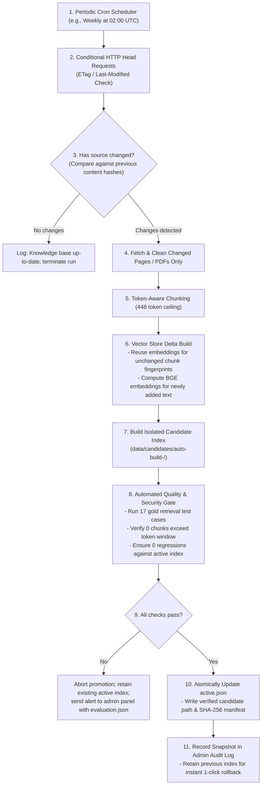

# PACE AI — Product & Architecture Roadmap

This document outlines the planned future architecture, upcoming feature enhancements, and technical debt items for PACE AI.

> [!IMPORTANT]
> **Implementation Notice**:
> All features and pipelines described in this document are **Planned / Future Work** and are **not currently implemented** in the active codebase. Ingestion remains an explicit, manual offline operation.

---

## 1. Feature Status Matrix

| Capability Area | Feature Name | Current Implementation Status | Target Release Phase |
| :--- | :--- | :--- | :--- |
| **Ingestion & Crawling** | Manual Offline Priority Crawler | **Implemented** (`src/crawler.py`) | Current |
| **Ingestion & Crawling** | Automated Periodic Web & PDF Refresh | **Planned (Unimplemented)** | Phase 2 |
| **Ingestion & Crawling** | OCR Engine for Scanned PDF Circulars | **Planned (Unimplemented)** | Phase 2 |
| **Ingestion & Crawling** | Conditional HTTP Header Scraping (ETags) | **Planned (Unimplemented)** | Phase 2 |
| **Retrieval & RAG** | Token-Aware Complete-Input Budgeting (448) | **Implemented** (`src/token_chunker.py`) | Current |
| **Retrieval & RAG** | Candidate Checksum Promotion & Rollback | **Implemented** (`select_index.py`) | Current |
| **Retrieval & RAG** | Background Embedding Model Warmup | **Planned (Unimplemented)** | Phase 1.5 |
| **Retrieval & RAG** | Formal Claim-to-Source NLI Entailment | **Planned (Unimplemented)** | Phase 3 |
| **Language Models** | Gemini 3.5 Flash Streaming via REST SSE | **Implemented** (`src/llm.py`) | Current |
| **Language Models** | Optional Local Qwen GGUF Provider | **Implemented (Inactive)** (`src/llm.py`) | Current |
| **User Interface** | Spotlight Hover Cards & Theme | **Implemented** (`app.py`, `ui.css`) | Current |
| **User Interface** | Persistent & Paginated Chat History | **Planned (Unimplemented)** | Phase 2 |
| **Security & Ops** | Institutional SSO / Student Authentication | **Planned (Unimplemented)** | Phase 3 |
| **Security & Ops** | Production Reverse Proxy & Rate Limiting | **Planned (Unimplemented)** | Phase 3 |
| **Dependencies** | Modular Dependency Profiles (Core vs Local) | **Planned (Unimplemented)** | Phase 2 |

---

## 2. Proposed Safe Automated Refresh Architecture

The current knowledge base reflects saved documents and an explicit CLI workflow. In future versions, an automated ingestion daemon will periodically inspect the PACE website for curriculum updates, circulars, and announcements without manual intervention.

### Key Safety Principles of the Planned Update Pipeline

1. **Non-Destructive Delta Ingestion**: Unchanged documents are not re-downloaded. Unchanged text chunks reuse existing 384-d vectors via `index.reconstruct()`, minimizing CPU usage.
2. **Never Write to the Live Path**: The crawler writes exclusively to a timestamped candidate directory (e.g., `data/candidates/auto-20261001/`).
3. **Automated Blocking Gate**: If the campus website alters its HTML structure or publishes an unparsable PDF, the evaluation gate fails and halts promotion automatically. The existing knowledge base remains active and unaffected.
4. **Instant Rollback**: The system retains at least two historical candidate versions on disk.

---

## 3. High-Priority Roadmap Features

### A. Optical Character Recognition (OCR) for Scanned Circulars
- **Current Limitation**: Scanned PDF circulars contain image bitmaps rather than digital text layers. PyMuPDF extracts 0 characters from these pages.
- **Proposed Solution**: Integrate an optional OCR pipeline (e.g., Tesseract or a lightweight on-device vision model) to transcribe scanned administrative circulars into searchable text.

### B. Startup Embedding Model Warmup
- **Current Limitation**: First semantic queries after startup take ~15 seconds due to lazy loading of PyTorch, Transformers, and BGE weights.
- **Proposed Solution**: Introduce an optional background thread on startup that silently loads BGE weights and encodes a dummy token, ensuring the first student query returns in <2 seconds.

### C. Natural Language Inference (NLI) Claim Entailment
- **Current Limitation**: Citation checks verify that `[S1]` matches a retrieved document URL, but do not verify whether the generated text logically follows from that excerpt.
- **Proposed Solution**: Add an offline or lightweight post-generation cross-encoder check verifying premise-hypothesis entailment before releasing answers.

### D. Multi-Turn Persistent Chat History
- **Current Limitation**: Conversations reside purely in `st.session_state` and vanish on page refresh.
- **Proposed Solution**: Implement an optional local SQLite or browser IndexedDB storage layer allowing students to browse and resume previous conversation threads.

### E. Dependency Manifest Separation
- **Current Limitation**: `requirements.txt` bundles heavy local generation packages (`torch`, `transformers`, `llama-cpp-python`, `accelerate`) even when Gemini is the chosen provider.
- **Proposed Solution**: Split dependencies into modular profiles:
  - `requirements-core.txt` (Streamlit, Requests, BeautifulSoup, PyMuPDF, FAISS, Rank-BM25)
  - `requirements-gemini.txt` (Lightweight cloud deployment)
  - `requirements-local-llm.txt` (Torch, Llama-cpp, CUDA extensions)
