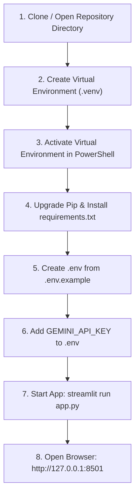

# PACE AI — Installation & Setup Guide

This guide provides step-by-step instructions for setting up, configuring, and launching **PACE AI** on a local workstation. It is written specifically for students, faculty, and developers.

---

## 1. Prerequisites

Before installing PACE AI, verify that your machine meets the following requirements:

- **Operating System**: Windows 10/11 (PowerShell), macOS, or Linux.
- **Python**: **Python 3.11** (specifically 3.11.x, e.g., 3.11.9). Python 3.12+ may encounter binary wheel incompatibilities with certain scientific libraries.
- **Memory (RAM)**: Minimum 8 GB RAM (16 GB recommended for building vector embeddings).
- **Disk Space**: At least 3 GB free disk space for virtual environments, model weights, and search indexes.
- **Internet Access**: Required for initial dependency installation and Gemini API calls (RAG retrieval itself runs locally).

To check your Python version, run:
```powershell
python --version
```
*Ensure the output reads `Python 3.11.x`.*

---

## 2. Step-by-Step Installation



### Step 1: Open PowerShell and Navigate to the Repository

Open Windows PowerShell and navigate to the project root:

```powershell
cd "C:\Users\Purna\OneDrive\Desktop\PACE AI\pace-ai-assistant"
```

### Step 2: Create a Clean Virtual Environment

Create an isolated virtual environment named `.venv` using Python 3.11:

```powershell
python -m venv .venv
```

### Step 3: Activate the Virtual Environment

On Windows PowerShell, run:

```powershell
.\.venv\Scripts\Activate.ps1
```

> [!NOTE]
> **PowerShell Execution Policy Error**:
> If PowerShell displays `File ... cannot be loaded because running scripts is disabled on this system`, execute this command in your current window to allow script activation:
> ```powershell
> Set-ExecutionPolicy -Scope Process -ExecutionPolicy Bypass
> .\.venv\Scripts\Activate.ps1
> ```

*(For macOS / Linux users, the equivalent activation command is: `source .venv/bin/activate`)*

Once activated, your command prompt will show `(.venv)` at the beginning of the line.

### Step 4: Upgrade Pip and Install Dependencies

Install all pinned project dependencies:

```powershell
python -m pip install --upgrade pip
python -m pip install -r requirements.txt
```

> [!TIP]
> `requirements.txt` includes pre-compiled CPU wheels for `llama-cpp-python` and pinned versions for `faiss-cpu`, `rank-bm25`, `sentence-transformers`, `pymupdf`, and `streamlit`.

---

## 3. Environment Configuration

PACE AI requires a local configuration file named `.env`.

### Step 1: Create `.env` from the Template

Copy the provided `.env.example` to create your local `.env`:

```powershell
Copy-Item .env.example .env
```
*(On Linux/macOS: `cp .env.example .env`)*

### Step 2: Configure Gemini API Key

Open `.env` in a text editor (Notepad, VS Code, etc.). Locate the `GEMINI_API_KEY=` line and enter your Google AI Studio key:

```dotenv
# .env
PACE_LLM_PROVIDER=gemini
PACE_GEMINI_MODEL=gemini-3.5-flash
GEMINI_API_KEY=AIzaSyYourActualKeyHere
```

> [!CAUTION]
> **Security Notice**:
> - Never commit `.env` to Git! The repository `.gitignore` explicitly excludes `.env`.
> - Never share your Gemini API key in public forums, screenshots, or bug reports.
> - If you previously shared or exposed a key, revoke and regenerate it immediately in [Google AI Studio](https://aistudio.google.com/).

---

## 4. Preparing Knowledge Directories & Index

PACE AI comes with pre-built candidate indexes under `data/candidates/`.

To verify that necessary directories exist and check the active index snapshot:

```powershell
python -c "from config import settings; settings.ensure_directories(); print('Directories verified!')"
```

To ensure the latest token-aware candidate index is active:

```powershell
python select_index.py --candidate data/candidates/token-448-20260912-v3
```
*Expected output: `Evaluated candidate selected; original index retained for rollback.`*

---

## 5. Starting the Application

You can launch PACE AI using either of two methods:

### Method A: Direct Streamlit CLI (Recommended)

```powershell
streamlit run app.py
```

### Method B: Using the PowerShell Startup Helper

The repository includes a helper script [`start.ps1`](file:///C:/Users/Purna/OneDrive/Desktop/PACE%20AI/pace-ai-assistant/start.ps1) that binds to localhost (`127.0.0.1`) automatically:

```powershell
.\start.ps1
```

### Customizing the Port

By default, Streamlit will bind to port `8501`. If port 8501 is occupied by another application, Streamlit will automatically attempt port `8502` or `8503`.

To explicitly specify a custom port:

```powershell
streamlit run app.py --server.port 8505 --server.address 127.0.0.1
```

---

## 6. Accessing the Workspace

Once started, Streamlit will display local access URLs:

```text
  You can now view your Streamlit app in your browser.

  Local URL: http://127.0.0.1:8501
  Network URL: (disabled by headless/localhost configuration)
```

1. Open your web browser and navigate to: **`http://127.0.0.1:8501`**
2. In the sidebar, check the status indicator:
   - **Green dot ("Ready to explore")**: Knowledge base loaded and verified.
   - **Gemini · online**: Cloud model configured and key present.
3. Type a question (e.g., *"What is the CSE R23 syllabus?"*) and press Enter.

---

## 7. Stopping the Server

To shut down the local server:

1. Return to your PowerShell terminal window.
2. Press **`Ctrl + C`**.
3. Streamlit will gracefully stop and release the network port.
4. To exit the virtual environment, run:
   ```powershell
   deactivate
   ```
