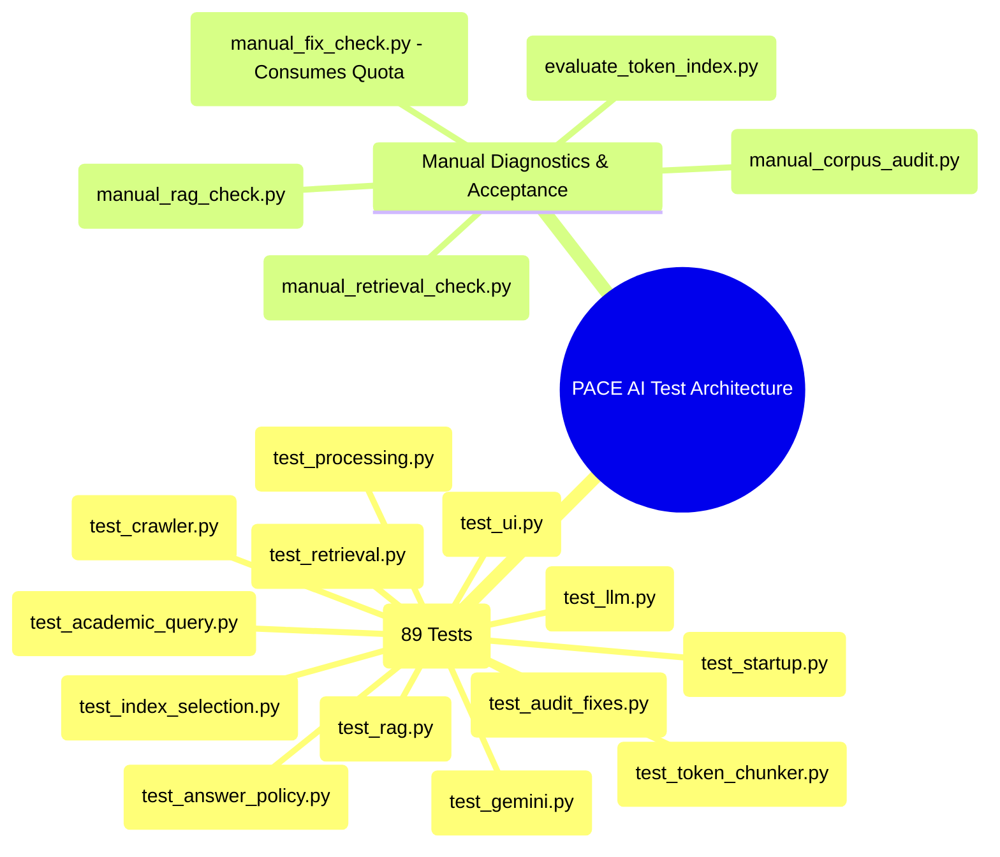

# PACE AI — Verification & Testing Manual

This document details the complete testing strategy for PACE AI, including automated unit and regression suites, offline corpus diagnostics, and live provider acceptance checks.

---

## 1. Test Suite Taxonomy

The test suite contains **89 automated unit and regression tests** implemented with `pytest`, plus **5 manual verification scripts**:



### Module Descriptions

| Test Module | File Path | Focus Area | Offline? |
| :--- | :--- | :--- | :--- |
| **`test_academic_query`** | [`tests/test_academic_query.py`](file:///C:/Users/Purna/OneDrive/Desktop/PACE%20AI/pace-ai-assistant/tests/test_academic_query.py) | Verifies branch regex (AIML, CSE, ECE), regulation detection (`r23`), course structure table parsing, and exclusion of unparsed overviews. | Yes |
| **`test_answer_policy`** | [`tests/test_answer_policy.py`](file:///C:/Users/Purna/OneDrive/Desktop/PACE%20AI/pace-ai-assistant/tests/test_answer_policy.py) | Tests conversational greetings, 3x repeated phrase loop detection, sentence buffering, and source removal on refusals. | Yes |
| **`test_audit_fixes`** | [`tests/test_audit_fixes.py`](file:///C:/Users/Purna/OneDrive/Desktop/PACE%20AI/pace-ai-assistant/tests/test_audit_fixes.py) | Verifies SSRF protections, redirect limits, PDF magic header checks, cache TTL expiry, and invalid question length rejection. | Yes |
| **`test_crawler`** | [`tests/test_crawler.py`](file:///C:/Users/Purna/OneDrive/Desktop/PACE%20AI/pace-ai-assistant/tests/test_crawler.py) | Tests URL normalization, query stripping, robots.txt handling, and academic PDF priority weighting. | Yes |
| **`test_gemini`** | [`tests/test_gemini.py`](file:///C:/Users/Purna/OneDrive/Desktop/PACE%20AI/pace-ai-assistant/tests/test_gemini.py) | Mocks Gemini REST API: verifies `x-goog-api-key` in header, thought filtering, HTTP 403/429/500 mapping to safe errors, and usage telemetry. | Yes (Mocked) |
| **`test_index_selection`**| [`tests/test_index_selection.py`](file:///C:/Users/Purna/OneDrive/Desktop/PACE%20AI/pace-ai-assistant/tests/test_index_selection.py)| Tests candidate hash verification, path containment, rejection of corrupted candidate files, and atomic rollback. | Yes |
| **`test_llm`** | [`tests/test_llm.py`](file:///C:/Users/Purna/OneDrive/Desktop/PACE%20AI/pace-ai-assistant/tests/test_llm.py) | Verifies detection of complete model weights vs. tokenizer-only caches. | Yes |
| **`test_processing`** | [`tests/test_processing.py`](file:///C:/Users/Purna/OneDrive/Desktop/PACE%20AI/pace-ai-assistant/tests/test_processing.py) | Tests PyMuPDF page extraction, 1-indexed page preservation, and text cleaning noise elimination. | Yes |
| **`test_rag`** | [`tests/test_rag.py`](file:///C:/Users/Purna/OneDrive/Desktop/PACE%20AI/pace-ai-assistant/tests/test_rag.py) | Tests context construction, source tag enforcement (`[S1]`), weak evidence gate skipping LLM, and direct course overview replies. | Yes |
| **`test_retrieval`** | [`tests/test_retrieval.py`](file:///C:/Users/Purna/OneDrive/Desktop/PACE%20AI/pace-ai-assistant/tests/test_retrieval.py) | Tests hybrid FAISS + BM25 scoring, BM25-only score isolation, and intent candidate promotion. | Yes |
| **`test_startup`** | [`tests/test_startup.py`](file:///C:/Users/Purna/OneDrive/Desktop/PACE%20AI/pace-ai-assistant/tests/test_startup.py) | Enforces lazy model loading: importing backend and UI modules *must not* import heavyweight local model libraries. | Yes |
| **`test_token_chunker`** | [`tests/test_token_chunker.py`](file:///C:/Users/Purna/OneDrive/Desktop/PACE%20AI/pace-ai-assistant/tests/test_token_chunker.py)| Enforces the 448 token ceiling, table row integrity, semester heading carrying, fingerprint calculation, and fail-fast truncation checks. | Yes |
| **`test_ui`** | [`tests/test_ui.py`](file:///C:/Users/Purna/OneDrive/Desktop/PACE%20AI/pace-ai-assistant/tests/test_ui.py) | Tests Streamlit session states, chat input handling, HTML escaping on source cards, and disabling queries on missing indexes. | Yes |

---

## 2. Running Automated Tests

All automated tests execute purely offline using mock providers, fixtures, and local files. They do **not** require internet access and consume **zero Gemini quota**.

### Run the Full Test Suite

```powershell
.\.venv\Scripts\pytest -v
```

*Current Verified Status:*
```text
============================= 89 passed in 19.25s =============================
```

### Run a Specific Test Module

```powershell
.\.venv\Scripts\pytest tests/test_rag.py -v
```

### Run Candidate Token Chunker & Index Selection Tests

```powershell
.\.venv\Scripts\pytest tests/test_token_chunker.py tests/test_index_selection.py -v
```

### Check Python Syntax Compilation

To ensure all files compile cleanly without syntax errors:

```powershell
.\.venv\Scripts\python -m compileall src config.py app.py build_index.py select_index.py tests
```

### Check Dependency Consistency

```powershell
.\.venv\Scripts\pip check
```
*Expected: `No broken requirements found.`*

---

## 3. Manual Diagnostics & Verification Scripts

The repository provides several specialized scripts under `tests/` for deeper empirical evaluation.

### A. Candidate Quality Gate (`tests/evaluate_token_index.py`)
- **Command**:
  ```powershell
  python -m tests.evaluate_token_index --output data/candidates/token-448-20260912-v3 --evaluate-only
  ```
- **Properties**: Completely offline. Loads local BGE embedding model. Evaluates 17 curated gold test cases. Verifies that 0 chunks exceed 512 tokens. Generates `evaluation.json`.

### B. Offline Retrieval Benchmark (`tests/manual_retrieval_check.py`)
- **Command**:
  ```powershell
  python tests/manual_retrieval_check.py
  ```
- **Properties**: Completely offline. Loads active FAISS and BM25 indexes. Tests 11 production benchmark queries without invoking an LLM. Writes results to `data/index/retrieval_acceptance.json`.

### C. Offline Corpus Diagnostic (`tests/manual_corpus_audit.py`)
- **Command**:
  ```powershell
  python tests/manual_corpus_audit.py
  ```
- **Properties**: Completely offline. Audits word lengths, model token windows, and document category distributions across the active vector records. Writes `data/index/audit_corpus.json`.

### D. End-to-End Latency Check (`tests/manual_rag_check.py`)
- **Command**:
  ```powershell
  python tests/manual_rag_check.py
  ```
- **Properties**: Measures first-token latency and total response time across 4 sample questions. *Note: Calls Gemini if `PACE_LLM_PROVIDER=gemini` is active.* Writes `data/index/rag_acceptance.json`.

### E. Live Gemini Acceptance Check (`tests/manual_fix_check.py`)
- **Command**:
  ```powershell
  python tests/manual_fix_check.py
  ```
- **Properties**:
  > [!WARNING]
  > **Consumes Live Gemini API Quota**:
  > This script sends real HTTP requests to Google AI Studio. It verifies end-to-end streaming, citation checks, and error boundaries against the live Gemini model. Writes `data/index/gemini_acceptance.json`.
