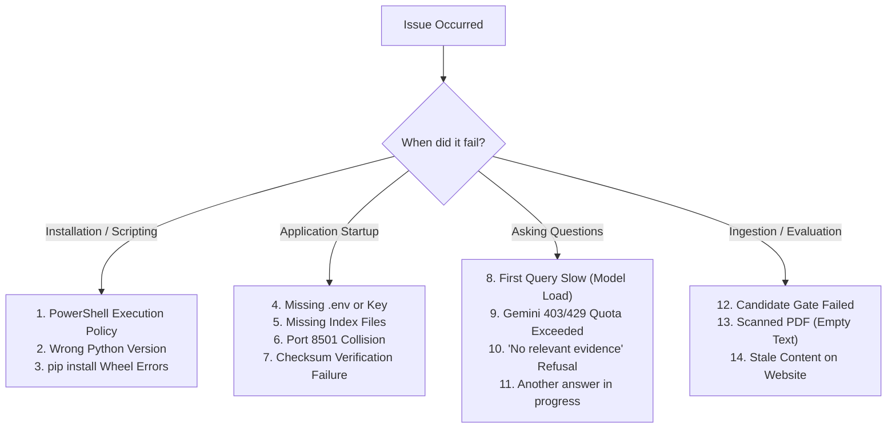

# PACE AI — Troubleshooting Manual

This guide provides direct, actionable solutions for common operational issues encountered during installation, indexing, runtime queries, and cloud generation in PACE AI.

---

## 1. Quick Diagnostic Flowchart



---

## 2. Setup & Environment Issues

### A. PowerShell Execution Policy Restriction
- **Symptom**: Running `.\.venv\Scripts\Activate.ps1` produces:
  `File ... cannot be loaded because running scripts is disabled on this system.`
- **Cause**: Windows PowerShell blocks unsigned scripts by default.
- **Fix**: Run the following command in your PowerShell terminal to bypass the restriction for the current process:
  ```powershell
  Set-ExecutionPolicy -Scope Process -ExecutionPolicy Bypass
  .\.venv\Scripts\Activate.ps1
  ```

### B. Wrong Python Version
- **Symptom**: Module errors during installation or incompatible C-extension builds.
- **Cause**: PACE AI requires **Python 3.11**. Python 3.12+ may encounter pre-compiled wheel incompatibilities with `llama-cpp-python` or scientific packages.
- **Fix**: Check your version:
  ```powershell
  python --version
  ```
  If it does not read `Python 3.11.x`, install Python 3.11 from [python.org](https://www.python.org/downloads/release/python-3119/) and re-create your `.venv`:
  ```powershell
  Remove-Item -Recurse -Force .venv
  py -3.11 -m venv .venv
  .\.venv\Scripts\Activate.ps1
  python -m pip install -r requirements.txt
  ```

---

## 3. Gemini Cloud LLM & API Issues

### A. Missing `.env` or Missing API Key
- **Symptom**: Streamlit sidebar displays warning: `Gemini key needed: add GEMINI_API_KEY to .env and restart.`
- **Cause**: The application cannot find `.env` or `GEMINI_API_KEY` is empty.
- **Fix**:
  1. Copy `.env.example` to `.env`:
     ```powershell
     Copy-Item .env.example .env
     ```
  2. Open `.env` and enter your key:
     ```dotenv
     PACE_LLM_PROVIDER=gemini
     PACE_GEMINI_MODEL=gemini-3.5-flash
     GEMINI_API_KEY=AIzaSyYourActualKeyHere
     ```
  3. Restart Streamlit (`Ctrl+C`, then `streamlit run app.py`).

### B. Gemini 403 Forbidden / Access Denied
- **Symptom**: UI error: `Gemini access was denied. Check your key's permissions and API availability.`
- **Cause**: The API key is invalid, revoked, or the Generative Language API is disabled in your Google Cloud / AI Studio project.
- **Fix**: Visit [Google AI Studio](https://aistudio.google.com/), verify your project status, and generate a new key. Update `GEMINI_API_KEY` in `.env`.

### C. Gemini 429 Quota Exceeded / Rate Limit Reached
- **Symptom**: UI error: `Gemini's request limit or quota has been reached. Check your Google AI Studio quota and try again later.`
- **Cause**: Free-tier Google AI Studio accounts have strict requests-per-minute (RPM) and requests-per-day (RPD) limits.
- **Fix**:
  1. Wait 60 seconds before submitting another complex question.
  2. Remember that greetings (`"hi"`) and syllabus overviews (`"tell me the syllabus of aiml in r23"`) bypass Gemini entirely and can be used without consuming quota.

### D. Invalid Gemini Model Name
- **Symptom**: UI error: `The Gemini model setting is invalid. Check PACE_GEMINI_MODEL in .env.`
- **Cause**: Model name contains unsupported characters or does not match `gemini-[a-zA-Z0-9.-]+`.
- **Fix**: Set `PACE_GEMINI_MODEL=gemini-3.5-flash` in `.env`.

---

## 4. Indexing, Candidate & Integrity Issues

### A. Missing Search Index Files
- **Symptom**: App displays: `Your campus library needs to be prepared before you can ask questions.`
- **Cause**: `vectors.faiss` or `bm25_corpus.json` is missing from the active index directory.
- **Fix**: Select the existing evaluated token candidate:
  ```powershell
  python select_index.py --candidate data/candidates/token-448-20260912-v3
  ```
  Or rebuild from scratch using:
  ```powershell
  python build_index.py
  ```

### B. Selected Index Failed Integrity Verification
- **Symptom**: Startup crashes with: `ValueError: Selected index failed integrity verification. Restore the previous snapshot.`
- **Cause**: One of the active candidate files (`vectors.faiss`, `vector_records.json`, `bm25_corpus.json`, `status.json`) was edited, truncated, or modified after evaluation.
- **Fix**:
  1. Roll back to the original baseline index:
     ```powershell
     python select_index.py --rollback
     ```
  2. Or re-evaluate the candidate to regenerate valid hashes:
     ```powershell
     python -m tests.evaluate_token_index --output data/candidates/token-448-20260912-v3 --evaluate-only
     python select_index.py --candidate data/candidates/token-448-20260912-v3
     ```

### C. Mismatched Embedding Model
- **Symptom**: Error on startup: `The saved embedding model does not match configuration. Rebuild the index before starting PACE AI.`
- **Cause**: The index was built with a different embedding model than the one specified in `PACE_EMBEDDING_MODEL`.
- **Fix**: Revert `PACE_EMBEDDING_MODEL=BAAI/bge-small-en-v1.5` in `.env`, or rebuild the candidate index with the new model.

---

## 5. UI & Runtime Operation Issues

### A. First Semantic Query Takes 15–20 Seconds
- **Symptom**: The first question asked after starting the app has high latency (~15s), but subsequent queries take 1–3 seconds.
- **Explanation**: This is normal expected behavior. To keep app startup fast (<2 seconds), heavyweight dependencies (`torch`, `sentence-transformers`, BGE model weights) are loaded lazily on the first semantic query. Once loaded into RAM, retrieval is fast.

### B. "Another answer is running in a different tab"
- **Symptom**: Submitting a question shows: `Another answer is running in a different tab. Please try again shortly.`
- **Cause**: PACE AI uses a non-blocking generation lock to protect shared single-process resources. If a query is already running, a concurrent query in another tab or window will be rejected cleanly rather than corrupting generation state.
- **Fix**: Wait for the active question to finish streaming.

### C. Streamlit Port 8501 Already in Use
- **Symptom**: Streamlit binds to port 8502 or 8503, or errors out.
- **Fix**: Specify an explicit port using command-line arguments:
  ```powershell
  streamlit run app.py --server.port 8505 --server.address 127.0.0.1
  ```

---

## 6. Document & Extraction Issues

### A. "I could not find this information in the indexed PACE sources"
- **Symptom**: The assistant refuses to answer a legitimate campus question.
- **Causes**:
  1. The question asks for topics not currently indexed in the public crawl (e.g., student grade portals requiring login, specific bus route numbers).
  2. Question contains vague phrasing.
- **Fix**: Check `Show retrieval details` in the sidebar to inspect the retrieved chunk scores and see why the evidence gate refused the query. Rephrase with specific branch or regulation names (e.g., *"CSE R23"*).

### B. Scanned / Image-Only PDFs
- **Symptom**: PyMuPDF extracts 0 characters from a downloaded PDF circular.
- **Cause**: The document is a scanned image without an embedded digital text layer. PACE AI does not currently have an OCR engine (planned for future work).
- **Fix**: Scanned circulars are logged in `data/raw/pdf_pages.json` with status `"no_text"`. Official syllabi and curriculum documents are digital text PDFs and extract cleanly.
