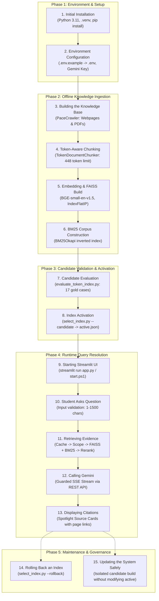
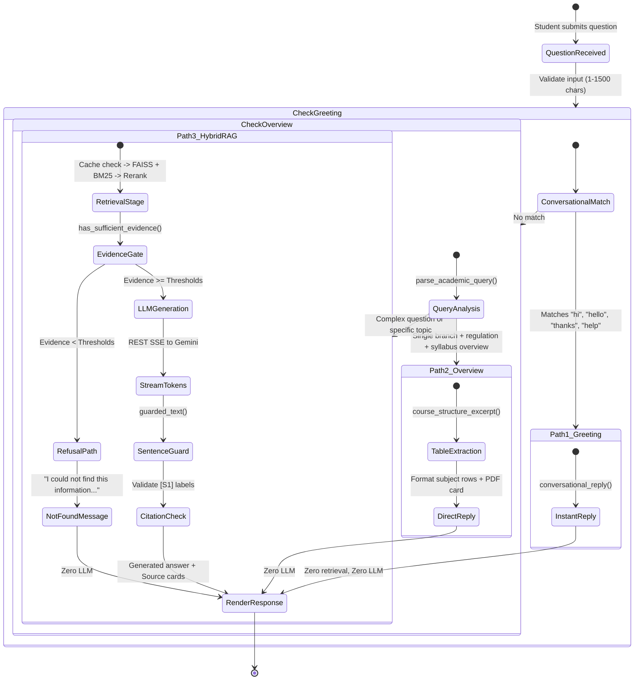
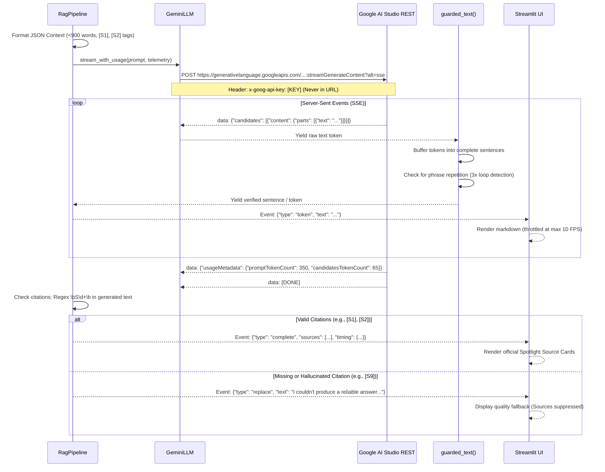
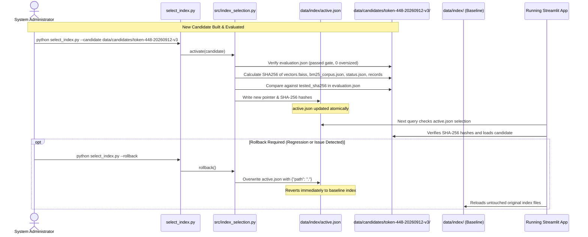

# PACE AI — System Workflows & Operational Lifecycles

This guide documents the end-to-end operational lifecycles of PACE AI, from initial repository installation to offline knowledge indexing, query resolution across three distinct answering pathways, candidate activation, and non-destructive index rollback.

---

## 1. The 15-Stage System Lifecycle

The entire operational existence of PACE AI is divided into 15 discrete, reproducible stages:

### Stage Details

1. **Initial Installation**: Developer clones the repository, provisions a clean Python 3.11 virtual environment (`.venv`), and installs pinned dependencies from `requirements.txt`.
2. **Environment Configuration**: Copies `.env.example` to `.env`. Adds `GEMINI_API_KEY` while keeping `.env` excluded from version control.
3. **Building the Knowledge Base**: `PaceCrawler` executes a polite, bounded crawl of `https://pace.ac.in/`, writing `data/raw/crawl.json`. `PacePdfLoader` downloads linked academic PDFs into `data/raw/pdfs/` and extracts page text via PyMuPDF into `data/raw/pdf_pages.json`.
4. **Token-Aware Chunk Generation**: `TextCleaner` eliminates cross-document repetitive boilerplate. `TokenDocumentChunker` splits pages budgeted against the *complete embedding input* (metadata + content <= 448 tokens) without splitting individual course table rows or losing semester headings.
5. **Embedding & FAISS Generation**: `EmbeddingModel` encodes chunks into 384-dimensional dense vectors using `BAAI/bge-small-en-v1.5`. Vectors are L2-normalized and stored in a FAISS `IndexFlatIP` (`vectors.faiss`).
6. **BM25 Construction**: `BM25Search` tokenizes chunks with field boosts (title x4, URL x4, department x3) and persists the inverted index to `bm25_corpus.json`.
7. **Candidate Evaluation**: `tests/evaluate_token_index.py` executes 17 curated gold acceptance cases against the new index snapshot in `data/candidates/<candidate-name>/`. Verifies zero oversized chunks and zero regressions against baseline.
8. **Index Activation**: `select_index.py --candidate <path>` records the verified candidate path and SHA-256 digests in `data/index/active.json`.
9. **Starting Streamlit**: Launches the web assistant using `streamlit run app.py` or `.\start.ps1`, binding to `127.0.0.1`.
10. **Asking a Question**: Student enters a question via the chat input (capped at 1,500 characters).
11. **Retrieving Evidence**: RAG pipeline checks retrieval cache -> filters by academic branch/regulation scope -> queries FAISS and BM25 -> fuses scores -> reranks lexically -> enforces evidence thresholds.
12. **Calling Gemini**: If evidence is sufficient and no shortcut applies, streams the prompt to Gemini REST API over HTTPS SSE using `gemini-3.5-flash` with minimal reasoning.
13. **Displaying Citations**: Renders streaming answer in Streamlit. Validates `[S1]`, `[S2]` citation tags and displays official clickable PACE source cards with PDF page numbers.
14. **Rolling Back an Index**: If an issue is discovered in the active candidate, `python select_index.py --rollback` atomically restores the untouched baseline index without data loss.
15. **Updating the System Safely**: New web crawls and PDF updates are always built in isolated candidate folders (`data/candidates/`), thoroughly tested, and promoted only after passing all safety gates.

---

## 2. The Three Answer Pathways

To optimize responsiveness, eliminate unnecessary API costs, and prevent hallucinations on structured data, PACE AI routes student inquiries through three distinct pathways:

### Deep Dive: When Gemini Is NOT Called

A critical design feature of PACE AI is that Gemini is invoked **only when necessary**. Specifically, Gemini is **never** called in the following scenarios:

| Scenario | Trigger Condition | Code Handler | Action Taken | Why Gemini is Skipped |
| :--- | :--- | :--- | :--- | :--- |
| **Conversational Greeting** | Questions matching `"hi"`, `"hello"`, `"good morning"`, `"thanks"`, `"what can you do"` | `conversational_reply()` in [`src/answer_policy.py`](file:///C:/Users/Purna/OneDrive/Desktop/PACE%20AI/pace-ai-assistant/src/answer_policy.py) | Returns friendly institutional greeting immediately. | Avoids wasting API quota and 1-2 seconds of latency on trivial chit-chat. |
| **Course Catalogue Overview** | Broad query such as `"What courses are offered at PACE?"` | `_direct_answer()` in [`src/rag_pipeline.py`](file:///C:/Users/Purna/OneDrive/Desktop/PACE%20AI/pace-ai-assistant/src/rag_pipeline.py) | Directs student to official Courses Offered page URL. | Course catalogues are too extensive for 80-word LLM answers; direct link is authoritative. |
| **Syllabus Overview** | Unambiguous request for 1 branch & 1 regulation syllabus (e.g., `"tell me the syllabus of aiml in r23 regulation"`) | `_overview_pages()` + `course_structure_excerpt()` in [`src/retriever.py`](file:///C:/Users/Purna/OneDrive/Desktop/PACE%20AI/pace-ai-assistant/src/retriever.py) | Parses numbered course structure table rows directly from PDF text. | Regex-parsed tables are 100% accurate; LLMs tend to drop course codes or hallucinate electives. |
| **Insufficient Retrieval Evidence** | Best chunk scores < 0.35 final score, or vector < 0.58 and lexical < 0.25 | `has_sufficient_evidence()` in [`src/rag_pipeline.py`](file:///C:/Users/Purna/OneDrive/Desktop/PACE%20AI/pace-ai-assistant/src/rag_pipeline.py) | Yields `NOT_FOUND` refusal message (`"I could not find this information in the indexed PACE sources."`). | Enforces strict hallucination guard; if PACE documents lack evidence, the LLM must not guess. |
| **Out-of-Scope Regulations** | Queries asking for nonexistent regulations (e.g., `"AIML R99 syllabus"`) | `_academic_scope()` in [`src/retriever.py`](file:///C:/Users/Purna/OneDrive/Desktop/PACE%20AI/pace-ai-assistant/src/retriever.py) | Returns empty allowed set -> immediate refusal. | Prevents confusing outdated or futuristic regulations with current curricula. |

---

## 3. Grounded RAG Generation Flow (Path 3)

When a factual campus question passes the evidence gate, the complete generation cycle executes as follows:

---

## 4. Rollback & Update Lifecycle

PACE AI prevents index corruption and deployment outages using an immutable snapshot pointer model:

By decoupling candidate creation from activation, PACE AI ensures that the running application is never left in an inconsistent or partially written state.
